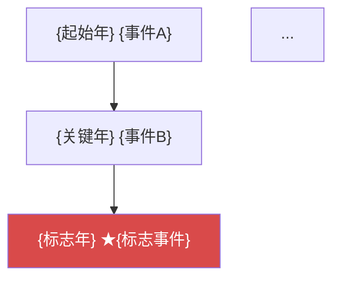
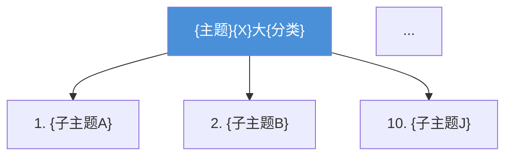
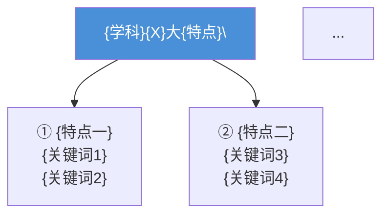
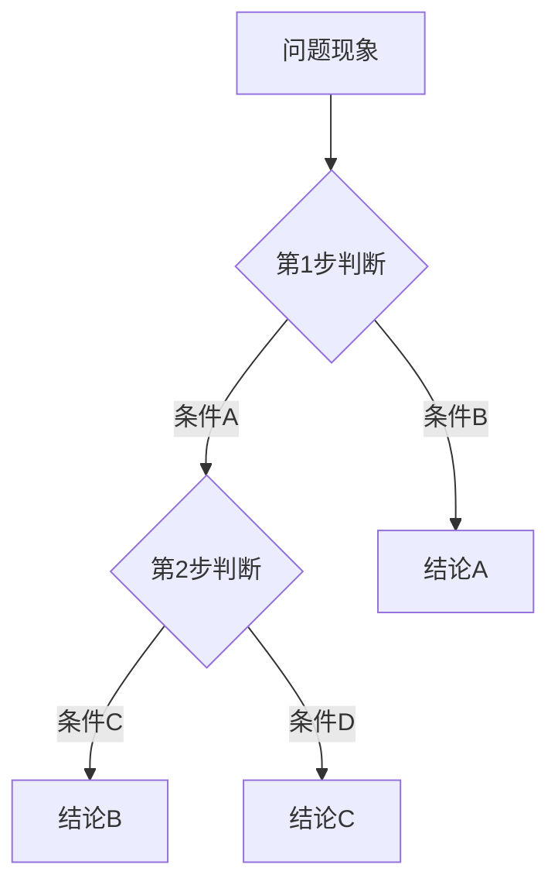

# book-build（基于知识库的教材编写）

## 核心理念

**大纲驱动，知识库供料，严格遵循结构，专业级学术写作。**

> **KB 是原料，教材是成品。** 不能把知识库中的模板结构（"学习目标""前置知识""精准释义"）直接复制到教材正文中，必须重新组织为自然叙述的学术散文。

> **专业教材 = 权威定义 + 直观引入 + 有编号的公式 + "式中"变量解释 + 含数字的实例 + 层次化习题。** 缺一个要素，教材感降一级；缺三个以上，降为科普文章或课程笔记。

---

## 🚨 体量铁律（用户核心要求）

每章的字节数必须是第1章字节数的 **5~10倍**。这是不容打折的硬性指标。

**示例**：第1章 = 83KB → 第2章目标 = 415~830KB，第3章目标 = 同倍数级。

**拒绝"浅尝辄止"**：每小节必须"大篇幅来讲细讲透"——不能点到为止。每个子主题需要：概念定义（多标准并列）+ 物理直观 + 公式推导（含编号） + 工程案例（三段式） + 对比表 + 数字实例。

---

## 📋 12条写作军规（来自三本教材分析）

以下12条规则是教材级的核心质量门槛，每写一章前必须逐条对照：

| # | 军规 | 来源 | 第2章示范 |
|:-:|:-----|:-----|:---------|
| 1 | **详实案例驱动** — 13个详细工程案例，每个有具体时间/地点/数字/分析 | 路宏敏 | 通信设备辐射超标事件、医疗监护仪ESD故障、家电出口退货 |
| 2 | **历史极致细节** — 具体日期+组织全称(含英文)+里程碑意义 | 路宏敏 | CISPR 1934年6月28-30日首次会议、TC 77成立于1973年 |
| 3 | **系统清晰结构** — 内容提要+学习目标+对比表+分层结构 | 梁振光 | 每节前设问过渡+章首7条学习目标+11张对比表 |
| 4 | **四阶段演进脉络** — 萌芽→形成→体系化→21世纪，国际国内双线 | 路宏敏 | 2.1三方法本身就是演进脉络 |
| 5 | **从现象到概念** — 日常电器现象引入→正式定义→深度案例递进 | 张亮 | "产品测试失败"引出问题解决法 |
| 6 | **工程实用导向** — 每项研究内容配工程场景和具体措施 | 张亮 | 分级筛选法配汽车200+电子模块案例 |
| 7 | **大篇幅讲细讲透** — 每子节≥40KB，不可点到为止 | 用户 | 2.1三子节约48KB、2.5九频段逐个展开 |
| 8 | **含数字实例** — 每节至少1个具体数字计算 | 教材通例 | 2.5配7个例题（dB换算/电长度） |
| 9 | **多标准并列定义** — 核心概念同时引用GB/T+IEC+IEEE+GJB | 梁振光+路宏敏 | EMC定义引用GB/T 4365+IEC+IEEE三条 |
| 10 | **概念对比表** — 易混淆概念用多维对比表而非文字列表 | 梁振光 | 2.1三方法对比表（9维度）、2.2五策略对比表 |
| 11 | **三级案例结构** — 每个案例必须经过+分析+启示三段式 | 用户+路宏敏 | 每个案例末尾有"启示"段提取教训 |
| 12 | **教学设问过渡** — 节间和小节间加设问/因果/转折过渡 | 教材通例 | 2.1→2.2→2.3→2.4→2.5各有设问过渡 |
| 13 | **公式全编号** — 每个显示公式都必须有 `\tag{N-M}` 编号。中间推导步骤、近似公式、换算关系等一律编号，不得遗留 | 用户 | 4.2传导耦合中KVL推导式、分段近似式全部编号 |

> **检查方法**：写完后用 `references/volume-standards.md` 的逐项清单勾选。

---

## 每章写作规范（本章必需）

**每章写作前必须加载本技能并阅读以下引用文件：**

1. `references/chapter-writing-workflow.md` —— **🚨 首要阅读！四步研读工作流：读三书→析写法→出指南→再动笔**
2. `references/volume-standards.md` —— **🚨 体量铁律+12条军规逐项清单**
3. `references/chapter-writing-standard.md` —— 完整的写作流程规范（含**三书融合写作法**）
4. `references/textbook-style-guide.md` —— 教材学术叙事风格指南
5. `references/writing-patterns.md` —— 各内容类型完整写作示例

**核心原则（来自三本已出版教材的路宏敏、梁振光、张亮）**：

**三书融合写作法**——每一节同时运用三种视角：
```
第1层：【张亮视角】——用日常现象建立认知锚点
  → 从电视机+荧光灯、手机+音箱、吹风机+收音机等日常经历入手
  → 先让读者有代入感，再引出专业术语

第2层：【梁振光视角】——给出系统的概念和定义
  → 在感性认识后给出标准定义，多标准并列
  → 用对比表/关系图分解概念要素

第3层：【路宏敏视角】——用极致细节深化理解
  → 每个工程案例有具体的时间、地点、数字、技术分析
  → 每条历史事件包含组织全称(含英文)、具体日期、事件意义
  → 每节至少2-4段实质性分析，不是点到为止
```

**写作禁止清单**：
- ❌ 不使用"Step 1-6"等显性教学标记
- ❌ 不过度使用第二人称"你"（教材用"人们""读者"或客观叙述）
- ❌ 不自创大纲不存在的章节结构
- ❌ 不写"概括式"历史事件（"1933年CISPR成立"×）→ 必须写"详实式"（"1933年，国际无线电干扰特别委员会CISPR在巴黎成立，第一次会议于1934年6月28-30日召开"✓）

```bash
# 在开始写任何一章前执行：
skill_view(name='book-build')
skill_view(name='book-build', file_path='references/chapter-writing-standard.md')
skill_view(name='book-build', file_path='references/textbook-style-guide.md')
```

```
用户提供大纲（.docx / .md / 文本）
        │
        ▼
  Phase 0: 解析大纲 → 章节分层树（章→节→子节）
        │
        ▼
  Phase 0.5: 三书研读 + 写作指南生成 ← 新！阅读 references/chapter-writing-workflow.md
        │    四步法：① 读三书对应章节原文
        │           ② 填写三书手法对比表
        │           ③ 标注三书共同盲区（发挥空间）
        │           ④ 生成该章专用写作指南（output/writing-guide-ch{N}.md）
        │
        ▼  对"每一节"循环：
  Phase 1: kb-qa 检索知识库 ← scripts/gen_prompt.py 调用 kb_search.py
        │   从指定 KB 目录搜索素材，按类型分组
        ▼
  Phase 2: 判断内容类型 ← scripts/detect_content_type.py
        │   6 种写作模式选其一
        ▼
  Phase 2.5: 生成写作指令 ← scripts/gen_prompt.py
        │   综合大纲定位+KB素材+内容类型+6要素规则
        │   输出每节的结构化提示词给 Agent
        ▼
  Phase 3: 学术散文写作（去模板化、物理直观→公式→实例）
        │   遵守 6 要素清单
        ▼
  Phase 4: 格式输出（.md / .docx）
        │
        ▼
  Phase 4.5: 清理临时文件 + 图号核验
        │    ① 删除扩展写作产生的 section-*.md、/tmp/*.md 等临时文件
        │    ② grep -n '图N-' 验证无重复图号
        │    ③ 检查每张Mermaid图有图号+文字说明
        │
        ▼
  Phase 5: 质量核验（6要素检查）
```

## 快速开始

```bash
# 0. 前置：加载依赖技能
skill_view(name='kb-qa')
skill_view(name='professional-textbook-compilation')

# 0.5 首要步骤（每章写前必须执行）：
#     参考 references/chapter-writing-workflow.md
#     ① 通读三本书对应章节原文
#     ② 分析三书写作手法，填写对比表
#     ③ 标注三书共同盲区（发挥空间）
#     ④ 生成该章写作指南 output/writing-guide-ch{N}.md
#     ⑤ **确认该章总字节数 = 第1章字节数 × (5~10)**

# 1. 解析大纲 → 章节树
python3 scripts/parse_outline.py 大纲.docx -o /tmp/outline.json

# 2. 对每节搜索 KB 获取素材（推荐用 kb-qa 的 kb_search.py）
cd <kb-qa_SKILL_DIR>/scripts/
python3 kb_search.py /Users/me/知识库 "章节标题" --format json

# 3. 判断内容类型
cd <book-build_SKILL_DIR>/scripts/
python3 detect_content_type.py "1.1 发展历史"

# 4. 生成每节的写作指令（核心步骤）
python3 gen_prompt.py \
  --outline /tmp/outline.json \
  --kb-dir /Users/me/知识库 \
  --chapter 1 --section 1.1 \
  -o /tmp/prompt_1.1.md

# 5. 将写作指令传给子 Agent 写作
delegate_task(goal="写第1章", context="见 /tmp/prompt_1.1.md")
```

## 前置条件

| 依赖 | 说明 | 验证 |
|:-----|:-----|:-----|
| `kb-qa` 技能 | 检索方法论（本技能重度依赖） | `skill_view(name='kb-qa')` |
| `python-docx` | 用于 .docx 输出（可选） | `pip install python-docx` |
| `professional-textbook-compilation` 技能 | .docx 辅助函数（可选） | `skill_view(name='professional-textbook-compilation')` |
| `file2md` 技能 | 当大纲是 .docx 格式时使用（可选） | `skill_view(name='file2md')` |

---

## 完整工作流（6 Phase）

```
Phase 0: 大纲解析       → 提取章节分层树，输出 /tmp/outline.json
Phase 1: kb-qa 检索     → 对每节搜索 KB，输出素材包（按类型分组）
Phase 2: 内容类型判别    → 6 种写作模式选其一
Phase 2.5: 生成写作指令  → gen_prompt.py 综合大纲+KB+类型+6要素，输出每节提示词
Phase 3: 学术写作        → 去模板化专业教材正文（6要素驱动）
Phase 4: 格式输出        → .md 或 .docx
Phase 5: 质量核验        → 结构/深度/学术/去AI味/6要素 五维检查
Phase 6: 版本提交        → git 提交，每个功能调整一次
```

## Git 提交规则（用户强制要求）

教材编写过程中涉及的技能修改、章节更新等，必须遵守以下提交规范。

### 规则一：一个功能调整 = 一次提交

错误做法：同时提交"更新SKILL.md + 改章节体量 + 加Mermaid图"三个无关改动到一个commit。

正确做法：
```
提交1：仅更新SKILL.md
git commit -m "v1.7.0: 新增Phase 4.5清理+图号核验环节"

提交2：仅改章节体量
git commit -m "第N章: 扩展某节内容加工程案例至48KB"

提交3：仅加图
git commit -m "第N章: 加5张Mermaid图（标准金字塔/术语因果链/dB换算等）"
```

### 规则二：提交说明必须有实质内容

提交前先 `git diff --stat --cached` 查看改动。

提交说明模板：
- 技能更新：`v版本号: 改动摘要`
- 章节更新：`第N章: 具体内容（体量/新案例数/图数）`

### 规则三：第一行简明 + 后续段落解释

```
v1.7.0: 补充Mermaid图标准和清理流程

- SKILL.md: 新增Phase 4.5（清理+图号核验）
- SKILL.md: 核验清单增加0c Mermaid量/0d图号/体量项
- volume-standards.md: 新增体量铁律+Mermaid≥6条检查
```

---

## Phase 0：大纲解析

### 支持的大纲格式

| 格式 | 处理命令 |
|:-----|:---------|
| .docx 文件 | `python3 scripts/parse_outline.py 大纲.docx -o /tmp/outline.json` |
| .md 文件 | `python3 scripts/parse_outline.py 大纲.md -o /tmp/outline.json` |
| 纯文本粘贴 | `python3 scripts/parse_outline.py /dev/stdin -o /tmp/outline.json`（粘贴后 Ctrl+D） |

### 输出 JSON 结构

```json
{
  "title": "书名",
  "chapters": [
    {
      "number": "1", "title": "第1章 绪论",
      "sections": [
        {"number": "1.1", "title": "1.1 研究背景", "subsections": []},
        {"number": "1.2", "title": "1.2 基本概念",
         "subsections": [
           {"number": "1.2.1", "title": "1.2.1 定义"},
           {"number": "1.2.2", "title": "1.2.2 分类"}
         ]}
      ]
    },
    {"number": "2", "title": "第2章 基础理论", "sections": [...]}
  ]
}
```

### 校验规则

- 章节编号连续（`第1章` → `第2章` → `第3章` 无跳跃）
- 节编号完整（`1.1` 后有 `1.2`，无缺失）
- 叶节点标题不为空

### 任务清单输出

```text
📋 写作任务清单（共计 N 个叶节点）
  ├── 第1章 绪论 (2节: 1.1-1.2)
  │   ├── 1.1 研究背景与意义     ← 待写
  │   └── 1.2 基本概念           ← 待写
  ├── 第2章 基础理论 (3节: 2.1-2.3)
  │   ├── 2.1 数学基础           ← 待写
  │   ├── 2.2 物理原理           ← 待写
  │   └── 2.3 关键技术指标       ← 待写
  └── 共 5 节
```

> ⚠️ **绝对原则**：大纲中每一节都必须写，不遗漏。同时**不添加大纲中不存在的章节**。

---

## Phase 1：kb-qa 检索

### 1.1 加载 kb-qa 技能

```text
skill_view(name='kb-qa')
```

取得 kb-qa Phase A 的检索方法论：关键词提取、跨目录搜索、读取匹配页面、合成回答。

### 1.2 搜索知识库

```bash
# 基本搜索
cd /path/to/book-build/scripts/
python3 search_kb.py /Users/me/知识库 "某技术"

# JSON 格式（供其他脚本消费）
python3 search_kb.py /Users/me/知识库 "1.1 研究背景" --format json --max-results 3

# 输出示例
# ──────────────────────────────────
# 📋 标题：某技术
# 🔑 关键词：某技术、某领域
# 📎 匹配结果：3 项
#
# ## 写作素材包：某技术
#
# ### 来源1：/Users/me/知识库/概念/某概念.md
# - **匹配方式**：filename（评分：10）
# ...
```

### 1.3 搜索策略自动适配

脚本自动检测 KB 目录结构，选择最优搜索策略：

| KB 结构 | 搜索方式 |
|:--------|:---------|
| domain-wiki 格式（概念/知识要素/知识点 目录） | 分层优先搜索，最高匹配度 |
| 按章分目录（第1章/第2章/...） | 先目标章再跨章 |
| 平面目录（所有 .md 同层） | 文件名优先 + 全文 grep |
| PDF/DOCX 原始文件 | 打印提示：建议先用 file2md 转换 |

详见 `references/kb-search-strategies.md`。

### 1.4 KB 素材 → 写作素材包

搜索结果自动组合为**写作素材包**（Markdown），包含：
- 每个匹配文件的内容预览（前500字符）
- 匹配类型和评分
- **覆盖评估**：哪些维度已覆盖（概念/公式/知识点/案例），哪些缺失

### 1.5 知识空白处理

如果某节在 KB 中完全无匹配：

> ⚠️ **必须完成**：即使 KB 零结果，也要基于通用领域知识写出标准教材内容。不可留"待补充"占位符。
> 写作完成后在质量报告中说明哪些节缺乏 KB 支撑。

---

## Phase 2：内容类型判别

每节开始前，判断内容类型以选择写作模式：

```bash
cd /path/to/book-build/scripts/
python3 detect_content_type.py "1.1 某领域的发展历史"
# → 历史叙事型

python3 detect_content_type.py "某原理" --has-formula yes
# → 原理推导型

python3 detect_content_type.py "某系统的特性"
# → 分类枚举型
```

### 6 种写作模式

| 内容性质 | 模式 | 触发词 |
|:---------|:-----|:-------|
| 发展历程 | **历史叙事型** | 发展历史、演进、沿革 |
| 概念定义 | **概念解构型** | 概念、定义、含义、概述 |
| 公式推导 | **原理推导型** | 原理、方程、公式、模型 |
| 系统结构 | **系统组成型** | 组成、结构、系统、架构 |
| 分类对比 | **分类枚举型** | 分类、类型、特性、指标 |
| 应用案例 | **工程案例型** | 案例、应用、实例、设计 |
| 混合 | **复合型** | 以上多种兼有 |

### 各模式写作结构

| 模式 | 结构 |
|:-----|:------|
| 历史叙事型 | 引出背景 → 时间线A→B→C → 总结收尾 |
| 概念解构型 | 一句话定义 → 分解要素 → 扩展举例 |
| 原理推导型 | 物理直观引入 → 公式 → 参数解释 → 实例 → 分析 |
| 系统组成型 | 总体框图 → 各部件功能 → 工作流程 |
| 分类枚举型 | 子主题1 → 子主题2 → 子主题3 → (可选)对比表 |
| 工程案例型 | 问题描述 → 方案设计 → 实施 → 效果 |

---

## Phase 3：学术写作

### 3.0 教材写作的通用开场结构

每一章必须以 **两个固定元素** 开场，定义全章基调：

#### 3.0.1 ① 内容提要（章导引）

```markdown
## 内容提要

本章是{领域}的导引章节，主要介绍{内容概述}，使读者对{主题}有一个总体的了解。
```

内容提要 1-2 段，作用是回答读者"这一章要讲什么、为什么重要"。**不出现在大纲中的章节也必须有内容提要**（它不是大纲里的"节"，而是章级元信息）。

#### 3.0.2 ② 学习目标（7条，可验证对答案）

内容提要之后，紧接 7 条具体的、可衡量的学习目标，每条以**可验证动词**开头：

每条学习目标必须满足两个条件：
1. **可验证**——学生学完本章后能回答这个问题（"掌握XX换算"→正文有例题；"理解XX概念"→正文有定义+案例）
2. **有正文覆盖**——写完本章后逐条检查：目标1的内容在正文哪个节？目标2的内容在正文哪个节？缺一条目标就说明正文缺内容

**第2章示例（7条目标 vs 正文覆盖检查）：**

| # | 学习目标 | 正文覆盖位置 | 正文支撑证据 |
|:-:|:---------|:------------|:-----------|
| 1 | 理解设计方法三阶段演进，掌握分级筛选四步 | §2.1节 | 三种方法各2-3案例+分级筛选4级详细展开 |
| 2 | 掌握五种抑制策略的原理、措施和适用条件 | §2.2节 | 每策略深度原理+对比表+频率适用性 |
| 3 | 了解国际/国内标准体系的层次结构 | §2.3节 | 三层金字塔图+组织关系图+中国标准对应表 |
| 4 | 熟悉常用术语的准确定义和相互关系 | §2.4节 | 5类术语+双标准引用+因果链Mermaid图 |
| 5 | 掌握dB完整换算体系 | §2.5.1节 | 完整推导+50Ω系统+5个例题 |
| 6 | 理解电磁波频谱划分和各频段EMC意义 | §2.5.3节 | 9频段逐一详解+频谱表 |
| 7 | 理解电长度的概念及其应用 | §2.5.4节 | 定义+3个工程应用+2个例题 |

```markdown
通过本章学习，读者应达成以下学习目标：

1. 准确区分{A}和{B}两个核心概念，理解{C}关系
2. 掌握{D}的{E}个要素，能用{F}方法分析具体问题
3. 理解{G}与{H}的区别与联系
4. 了解{Z}从{起始年}到{当前}的发展脉络和里程碑事件
5. 建立对{主题}的体系化认知
6. 理解{学科}的{X}大特点及其对学习方法的指导意义
7. 掌握{工具方法}的基本定义和应用方法
```

目标动词的强度梯级：

| 层级 | 动词 | 搭配 | 适用 |
|:----|:-----|:-----|:-----|
| L1 认知 | 了解、认识 | 发展历程、基本概念 | 历史叙事 |
| L2 理解 | 理解、掌握 | 定义、要素、特点 | 概念解构 |
| L3 应用 | 区分、分析、运用 | 案例分析、工程诊断 | 原理推导 |
| L4 综合 | 建立、评估、设计 | 体系化认知、设计方法 | 系统组成 |

> 学习目标不可写成抽象的"本章介绍了..."——那是内容提要的职责。学习目标是**对读者的承诺**，写在章前、兑现于章末的习题中。

### 3.0.3 ③ 内容提要 + 学习目标 完整示例

```markdown
# 第1章 绪论

## 内容提要

电磁兼容是研究在有限的空间、时间和频谱资源条件下，各种用电设备（广义的还包括生物体）可以共存，并不致引起降级的一门学科。本章是{领域}的入门章节，旨在帮助读者建立对{学科}的宏观认知。

通过本章学习，读者应达成以下学习目标：

1. 准确区分{A}、{B}与{C}三个核心概念，理解三者之间的因果关系
2. 掌握{D}三要素，能用三要素分析法诊断实际工程问题
3. 理解{E}与{F}的区别与联系
4. 了解{领域}从{起始年}到{当前}的发展脉络和里程碑事件
5. 建立对{领域}X大研究内容的体系化认知
6. 理解{学科}六大特点及其对学习方法的指导意义
7. 掌握{工具}制的基本定义和换算方法

---
```

> 内容提要 + 学习目标 之后用 `---` 分隔符与正文区分，形成"章首元信息区"。

---

### 3.0.4 基于真实教材分析的写作模式

以下写作规范来自于对《电磁兼容原理技术及应用第2版》（梁振光）10 章正文的系统分析。这不是理论推导，而是对已出版教材写作模式的还原。

#### 3.0.1 每章开头的固定结构

每一章都以两个固定元素开头：

**① 内容提要（章导引）** — 1-2 段，概括本章内容：
```markdown
## 内容提要

本章是{领域的}导引，主要介绍{内容概述}，使读者对{主题}有一个总体的了解。
```

**② 开篇定义/背景引入** — 在第一个节前，有一段概述性文字定位本章在全书的角色。

#### 3.0.2 节内子主题的编号方式

子主题使用 `## N. 标题` 格式（`##` 二级标题，数字加顿号），而不是 `###` 三级标题：

```markdown
## 2.2.1 电磁骚扰的一般分类

电磁骚扰一般可分为两大类：自然骚扰和人为骚扰。

## 1. 按属性分类

人为骚扰源按其属性可分为功能性骚扰和非功能性骚扰。

## 2. 按耦合方式分类

按电磁骚扰耦合方式可分为传导骚扰和辐射骚扰。
```

> 注意：子主题标题级别为 `##`（同节标题级别），用 `N.` 编号区分。这是该教材的统一模式。

#### 3.0.3 段落长度的真实分布

该教材测量结果：段落长度从**单句**到**500+字**不等，分布为：

| 段落类型 | 典型字数 | 特征 |
|:---------|:--------:|:-----|
| 长段（历史叙事） | 300-600 字 | 时间线叙述，信息密集 |
| 中段（概念阐释） | 100-300 字 | 定义+举例，主体段落 |
| 短段（过渡/强调） | 30-80 字 | 引出新话题、强调结论 |
| 单句段（实例列举） | 10-30 字 | "例如，..."独立成段 |

**不要控制每段等长。** 真实教材的段落长度是自然的——核心主题长段展开，辅助主题短段带过。

#### 3.0.4 公式的融入模式

公式在教材中的位置规律：

```markdown
[引出文字] — 1-3 句推导说明，解释为什么要引入这个公式

$$公式\tag{章-节号}$$

式中，{符号A}为{含义}（{单位}），{符号B}为{含义}（{单位}）。
```

公式总是被"推导"出来，且永远带有编号 `\tag{章-序号}`。

#### 3.0.5 图的引用模式

图在正文中的出现顺序：

```text
1. 文字描述："如图 X-Y 所示，..."
2. 图的放置：紧接着描述段落之后
3. 图题格式："图 X-Y 图标题"
```

> 图的放置是先有文字描述，然后才是图本身。文字描述中已说明了图的内容。

#### 3.0.6 定义的处理模式

当需要给出正式定义时，通常引用标准（国家标准/国际标准）：

```markdown
电磁兼容性（Electromagnetic Compatibility，EMC），按国家标准
GB/T 4365—2003《电工术语 电磁兼容》的定义：{完整定义}。

国际电工委员会（IEC）的定义：{定义}。

美国电气电子工程师学会（IEEE）的定义：{定义}。

上述{数量}个定义虽措辞不同但反映的都是{核心意思}。
```

多个权威定义并列，然后归纳共同点。不是只给一个定义。

#### 3.0.7 实例嵌入的三种方式

| 方式 | 示例 |
|:-----|:------|
| **生活类比** | "在 CRT 显示器旁使用手机，显示器的图像会受到影响，这里手机是骚扰源..." |
| **工程计算** | "以下进行实例分析。假定某系统作用距离为100km，发射功率为100kW..." |
| **历史事件** | "1982年的贝卡谷地之战，以色列利用无人机诱饵和电子干扰..." |

#### 3.0.8 章节结尾的模式

教材中每章结尾有两种模式（根据内容选一种即可，不可并用）：

**模式 A：直接以思考题结尾**（适用于内容自洽的章节）：
```markdown
## 思考题

1. 为什么要对产品进行电磁兼容设计？
2. 电磁干扰有什么危害？
3. 将下列功率比值转换为分贝：2:1, 3:1, ...
```

**模式 B：要点总结 + 思考题**（适用于技术性强的章节）：
```markdown
- 屏蔽是用于抑制电磁骚扰在空间中的传播；
- 屏蔽设计应抓好两点：一是自屏蔽的处理，二是非完整屏蔽的处理；
- ...

## 思考题

1. 静电屏蔽的原理是什么？
2. 计算 0.15mm 厚的铝箔对 100Hz 电磁波的屏蔽效能。
```

> 要点总结是可选的，且不要标记为"本章小结"——直接以列表自然收尾。

#### 3.0.9 习题的组成

习题不只是概念题和计算题。该教材的习题包括：

- **概念题**："电磁干扰有什么危害？"
- **简答题**："电磁兼容设计方法经历了哪几个阶段？"
- **数值计算题**："将下列功率比值转换为分贝：2:1, 3:1, 4:1, ..."
- **参数计算题**："计算 0.15mm 厚的铝箔对 100Hz、10kHz、100MHz 和 1GHz 的电磁波的屏蔽效能。"
- **综合分析题**："一台塑料机壳的设备，其电磁辐射超标...分析可能是什么原因。"

数值计算题为每个问题给出具体数字参数，而不是抽象的"已知A=B求C"。

### 3.1 内容的序贯依赖（跨章节引用）

专业教材的第 N 章不是孤立存在的。它与前后章节构成知识链：

**引用规则**：
- 第 N 章可以引用第 1~N-1 章的内容（已学知识）
- 第 N 章**不能**引用第 N+1 章及之后的内容（还没学）
- 同一术语在全书使用统一译名和定义（不重新定义）
- 公式编号使用章级前缀：`\tag{N-序号}`（如 `\tag{2-1}` 表示第 2 章第 1 个公式）

**引用的自然写法**：

```markdown
由第{前章}章中的{前章概念}可知...（引用已学概念）

在第{前章}章图{图号}所示的电路中...（引用前章图）

根据式（{前章公式号}）...（引用前章公式）
```

> 这在实践中还有一个作用：读者教材**不能跳章读**，必须按顺序。第 1 章定义的术语第 3 章直接使用。

### 3.2 物理直观先于数学形式

这是专业教材区别于论文和手册的关键特征。**任何公式出现之前，必须先给出直观理解。**

```markdown
✅ 正确模式：
人离物体越远，就越难看清物体。同样的道理，{系统}发现{目标}，
也有一个距离的限制。下面通过{方程名}来分析。

$$方程$$

❌ 错误模式（论文写法）：
{方程名}定义为：$$方程$$ 式中，...

❌ 错误模式（笔记写法）：
下面介绍{方程名}。公式如下：$$方程$$
```

**直观引入的三种方式**：

| 方式 | 适用场景 | 示例框架 |
|:-----|:---------|:---------|
| **日常经验类比** | 物理原理类内容 | "{日常现象}。同样的道理，在{领域}中..." |
| **问题导向** | 需要公式解决的问题 | "要回答这个问题，首先需要明确..." |
| **历史溯源** | 公式/概念的起源 | "{人名}在研究{问题}时，提出了..." |

### 3.3 段落节奏变化

参考 3.0.3 的真实分布，不可人为控制段落等长：

- **长段（发展历程/综合论述）**：300-600 字，一气呵成不分段
- **中段（概念阐释）**：100-300 字，定义+举例的主体段落
- **短段（过渡/强调）**：30-80 字，引出新话题或强调结论
- **单句段（实例引入）**：10-30 字，如"例如，..."独立成段

### 3.4 过渡多样化

避免只使用"下面讨论""接下来""如上所述"。交替使用 5 种过渡：

| 类型 | 示例 |
|:-----|:------|
| **设问** | "为什么某系统能比另一系统更早发现目标呢？" |
| **类比** | "人离物体越远，就越难看清物体。同样的道理..." |
| **递进** | "上述分析基于简化条件。在实际工程中，还需要考虑..." |
| **转折** | "然而，以上结论仅在自由空间传播条件下成立..." |
| **因果** | "由于信号在传播过程中受到多种因素的影响，因此..." |

### 3.5 公式融入叙述

```
下面通过某方程具体加以说明。为分析方便，假定某系统采用标准配置，
此时简化的方程如下：

$$
P_r = \frac{P_t G_t G_r \lambda^2}{(4\pi R)^2}
$$

式中，$P_r$ 为接收信号功率（W），$P_t$ 为发射功率（W），$G_t$ 为发射天线增益。
```

**核心规则**：公式不是被"呈现"的，而是被"推导"出来的。每个公式前有引出文字，后有"式中"变量解释。

### 3.6 实例嵌入正文

实例不单独成节，自然融入叙述：

```
以下进行实例分析。假定某系统作用距离为100km，发射功率为100kW...

（1）对某模式的分析：此时，参数A取30，代入计算得...

（2）对某模式的分析：一般此类系统特性X通常比特性Y低20-30...
```

### 3.7 枚举方式变化

不要总是 ①②③④，交替使用：

- "其主要包含三方面含义：一是...二是...三是..."
- "概括起来，有以下几点特征：首先...其次...最后..."

### 3.8 结论自然呈现

不强制加"启示"或"小结"。结论可以通过推理自然呈现。

### 3.9 章节结尾：习题

参考 3.0.9 的真实分布。习题有四个层次，覆盖不同认知深度：

| 层次 | 类型 | 考察重点 | 示例 |
|:-----|:-----|:---------|:-----|
| L1 概念理解 | 问答题 | 基本术语和概念掌握 | "什么是{x}？为什么要{x}？" |
| L2 公式应用 | 数值计算题 | 代入公式求具体值 | "计算厚度d、频率f下的{y}" |
| L3 综合判断 | 多参数计算+分析 | 系统级思维 | "已知A,B,C，求D，并分析E的变化趋势" |
| L4 故障诊断 | 给定现象分析原因 | 工程思维 | "某设备出现{现象}，分析可能的原因" |

习题标题统一用 （Level 2），不另加编号。

> 核心规则：数值计算题必须有**具体数字参数**（"计算 0.15mm 铝箔对 100Hz 的屏蔽效能"），
> 而不是抽象的"已知A=B求C"。

### 3.10 从 KB 素材到教材正文的转换规则

| KB 节点类型 | 教材中的使用方式 |
|:------------|:----------------|
| 概念/（0.95） | 引用为权威定义，用学术语言重述 |
| 知识要素/（0.85） | 转换为教材公式 + "式中"段落 |
| 知识点/（0.85） | 作为主体素材，改写为流畅叙述 |
| 技能点/（0.75） | 融入操作流程或工程案例 |
| 场景/（0.65） | 转为实例分析（"例如，在某工程中..."） |

> **核心规则**：不要直接复制 KB 模板结构（"精准释义：...本质特征：..."）。KB 是原料，教材是成品。

### 3.11 每节自查清单

- [ ] 有物理直观或背景引入？（第一段不是公式）
- [ ] 段落长度有变化？
- [ ] 过渡词有变化？（不是每次都"下面"）
- [ ] 公式有"式中"变量解释？
- [ ] 有嵌入实例或数值例子？
- [ ] 枚举方式有变化？
- [ ] 结论自然呈现？

---

### 3.12 进阶写作模式（从真实教材提炼）

以下模式来自对已出版教材的分析，补全 3.0-3.11 未覆盖的"教材感"来源。

---

#### 3.12.1 多标准并列定义法

处理概念定义时，**不要只给一个定义**。同时引用 3-4 个权威标准：

```markdown
### {概念}的定义

**{概念}（{英文}）** 是指{概括定义}。

国家标准 GB/T {编号}《{名称}》的定义与 IEC 60050-161 一致：{定义}。

国际电工委员会（IEC）的定义是：{定义}。

美国电气电子工程师学会（IEEE）的定义是：{定义}。

国家军用标准 GJB {编号}的定义更加直接：{定义}。

上述{数量}个定义虽措辞不同，但反映的都是同一个核心要求——{归纳核心}。
具体包含两个条件：
- **条件一**：{条件A}
- **条件二**：{条件B}

两个条件缺一不可。只满足条件一而不满足条件二，意味着{解释A}；
只满足条件二而不满足条件一，意味着{解释B}。
```

> **适用**：绪论、核心概念节中的术语定义。不要只引用一个标准就收工。

---

#### 3.12.2 概念关系形式化

对于初学者容易混淆的成对概念，用数学符号表达因果关系比大段文字更清晰：

```markdown
**{A}与{B}的因果关系可以形式化描述为：**

$$
\\text{{A}} \\xrightarrow{\\text{通过{条件}}} \\text{{B}} \\tag{1-1}
$$

即：{A}是原因、是现象；{B}是结果、是后果。这种因果关系的理解是学习{学科}的逻辑起点。
```

对于三要素型关系，还可以扩展为数学模型：

```markdown
任何{问题}的产生，必须同时具备三个基本条件，称为三要素：

- **{源S}**：{定义}
- **{通道C}**：{定义}
- **{接收器R}**：{定义}

三要素之间的关系可以用以下数学模型描述：

$$
E(f) = S(f) \\cdot C(f) \\cdot R(f)
$$

式中，$S(f)$为{源函数}（{单位}），$C(f)$为{通道传递函数}（描述{方式}），$R(f)$为{接收器响应函数}（{单位}）。

当 $S(f) \\times C(f) \\times R(f)$ 超过{阈值}时，即产生{问题}。
```

> 这种数学积模型比纯文字描述的三要素更精确，也更有"教材感"。

---

#### 3.12.3 概念对比表（C 型表）

当需要区分两个相似概念时，**不要用文字列表**，用多维对比表：

```markdown
**表 {章}-1：{A}与{B}的详细对比**

| 对比维度 | {A} | {B} |
|:---------|:-------------|:------------|
| 本质 | {本质A} | {本质B} |
| 因果角色 | {角色A} | {角色B} |
| 是否必然造成{后果} | {是否A} | {是否B} |
| 存在条件 | {条件A} | {条件B} |
| 消除方式 | {方式A} | {方式B} |
| 物理量描述 | {物理A} | {物理B} |
| 标准术语来源 | {标准A} | {标准B} |
| 典型实例 | {实例A} | {实例B} |
```

对比维度至少 5 条，最佳 7-8 条。维度名称必须是对应术语对的**直接对立面**（如"本质"对"本质"、"原因"对"结果"）。

---

#### 3.12.4 概念内涵拓展的嵌套结构

当定义完一个核心概念后，需要展开其多维度内涵。使用"{{类型}} vs {{类型}}"子节 + 对比表的嵌套结构：

```markdown
#### （1）{概念A} vs {概念B}

| 对比维度 | {概念A} | {概念B} |
|:---------|:--------|:--------|
| 研究范围 | {范围A} | {范围B} |
| 距离尺度 | {距离A} | {距离B} |
| 控制能力 | {控制A} | {控制B} |
| 设计自由度 | {自由A} | {自由B} |
| 典型方法 | {方法A} | {方法B} |

#### （2）{更多维度}

{文字说明}
```

---

#### 3.12.5 发展历程的三阶段 + 双线叙事

时序类内容采用"三阶段叙事 + 国际/国内双线 + 对照表"三重结构：

```markdown
### 1.2 {领域}的发展历程



*图 1-3：{领域}发展时间线*

#### 1.2.1 国际{领域}发展

**【阶段名（起止）】**

- **{年份}年**：{事件描述}，{意义}
- **{年份}年**：{事件描述}，{意义}

**【阶段名（起止）】**

- **{年份}年**：{事件描述}，{意义}
- **{年份}年**：{事件描述}，这是{领域}形成的**标志性事件**

#### 1.2.2 国内{领域}发展

{国内背景}起步较晚但发展迅速：

- **{年代}**：{事件描述}
- **{年份}年**：{事件描述}
- ...

| 年代 | 国际 | 国内 |
|:----:|:----|:----|
| {年} | {事件} | — |
| {年} | {事件} | {事件} |
...
```

**关键规则**：
- 分为 2-3 个阶段（萌芽期→形成期→成熟期），每阶段有阶段名+起止年份
- 国际和国内分两小节写
- 最后放一个对照表

---

#### 3.12.6 Mermaid览观 → 文字深解（Overview→Detail）

当有 5-15 个并列子主题时，**先给 Mermaid 总览图，再逐一文字深解**：

```markdown
### 1.3 {领域}的{X}大{分类}

{主题}是{总括句}，涵盖以下{X}方面：



*图 1-4：{主题}{X}大{分类}体系*

### 1.3.1 {子主题A}

{2-5 段详细解释，每个至少 150 字}。{内容包括：定性描述→核心内涵→典型方法→前沿方向}。

### 1.3.2 {子主题B}

...

最后放**映射表**，将每项子主题与核心框架建立关联：

| {分类} | 核心问题 | 与{框架}的关系 | 所属学科 |
|:-------|:---------|:---------|:-------|
| {子主题A} | {问题A} | {关系A} | {学科A} |
| {子主题B} | {问题B} | {关系B} | {学科B} |
...
```

---

#### 3.12.7 特性/特点节的模式

当介绍学科或系统的特点时，使用统一的子节格式：

```markdown
### 1.4 {学科}的{X}大{特点}

{总起段}。



*图 1-6：{学科}{X}大{特点}*

### 特点一：{标题}

{100-200 字解释}。

### 特点二：{标题}

{100-200 字解释}。
```

> 特点的编号使用中文数字（特点一、特点二...），而不是阿拉伯数字。

---

#### 3.12.8 工具/方法类内容的深度处理（如分贝换算）

当某节介绍一个工程工具时，不只给定义，要覆盖**定义→便利→换算表→换算公式→例题→速查表→图示**的全链条：

```markdown
### 特点X：{工具名称}

{背景引入}。在{领域}工程中，几乎所有的量值都采用{工具}表示。

**（1）{工具}的基本定义**

{工具}是{定义}：

$$
\\mathrm{dB} = 10\\lg\\left(\\frac{P_2}{P_1}\\right)
$$

对于{X}{对比量}，考虑到 {原理}：

$$
\\mathrm{dB} = 20\\lg\\left(\\frac{U_2}{U_1}\\right)
$$

使用{工具}的主要便利在于：{原因}

$$
10\\lg\\left(\\frac{P_2}{P_1}\\right) = 20\\lg\\left(\\frac{U_2}{U_1}\\right)
$$

此外，{领域}中量值的动态范围极大（从{nW}到{MW}），用{工具}表示后数值范围大大压缩。

**（2）{领域}常用{工具}单位换算**

| 单位 | 定义 | 示例 |
|:----|:----|:----|
| {单位A} | {定义A} | {示例A} |
| {单位B} | {定义B} | {示例B} |
| ... | ... | ... |

**{典型系统}中的{换算关系}（最常用！）：**

$$
U_{\\mathrm{{结果单位}}} = P_{\\mathrm{{源单位}}} + {常数} \\quad ({系统})
$$

**例 {章}-1**：{问题描述}

解：{逐步推导}。$U = {计算} = {结果}$，即 {说明}。

**例 {章}-2**：{问题描述2}

解：{逐步推导}。{公式} = {计算}。

**（3）{工具}运算速查表**

| 比值 | {量A} | {量B} |
|:----:|:----:|:----:|
| 2:1 | 3 dB | 6 dB |
| 10:1 | 10 dB | 20 dB |
| 100:1 | 20 dB | 40 dB |
| 1000:1 | 30 dB | 60 dB |

```mermaid
graph LR
    {单位A}[改换{UnitA}...] -->|"+{常数}"| {单位B}[换行{UnitB}...]
    ...
```

*图 {章}-5：{领域}常用{工具}换算关系*
```

> **适用场景**：任何需要介绍一个工程工具或单位制的章节（不仅是 dB）。这是"教材感"最强的写法——也是读者最需要的参考内容。

---

#### 3.12.9 本章总结（Chapter Summary）——必须图文并茂

每章末尾的总结必须包含**两种形式**：一张知识结构总览 Mermaid 图 + 一个六要点表格。用户明确要求"不要只有文字，要图文并茂"。

**Mermaid 图规范**：
- 使用 `%%{init: {"flowchart": {"useMaxWidth": false}}}%%` 防止 Obsidian 自动缩小
- 使用 `graph LR`（横向）而非 `graph TB`（纵向）以获得更多宽度
- 控制在 10 个节点以内，每个节点文字不超过 6 个中文字（不含 `<br/>`）
- 禁止使用 emoji（某些 Mermaid 版本渲染 emoji 会出错或导致整个节点空白）
- 使用 `subgraph` 分组归类，增强可读性
- Mermaid 后必须跟 `*图 X-Y：图标题*` 文字说明

**下方表格规范**：6条要点，每条以**粗体关键字**开头，每条独立可读，右栏标注对应章节来源。

> 要点数量 = 本章节数或略少（5-7 条）。每条独立可读。不使用"关键公式卡片"或"本章在全书中的定位"等独立图表框。

```markdown
## 本章总结

1. **{概念A}**是{一句话定义}，**{概念B}**是{一句话定义}，三者构成{关系}的逻辑链条。
2. 任何{问题}必须同时具备**{三要素}**：{要素A}、{要素B}、{要素C}。{策略}就是{策略}。
3. {概念C}分为**{子类A}**（{定义}）和**{子类B}**（{定义}）。
4. {领域}从{起始年}{起始事件}至今已逾{X}年。标志性事件：{事件A}（{年}）、{事件B}（{年}）。
5. {主题}{X}大{分类}围绕{框架}展开，涵盖从{维度A}到{维度B}的全方位知识体系。
6. {工具}是{领域}工程中**最核心的{X}**。{关键公式}是最常用的换算公式。
```

> 要点数量 = 本章节数或略少（5-7 条）。每条独立可读。结束句不可跨条。**有公式嵌入时跳过无需解释。**
> ⚠️ 标题数字必须与实际条数一致——如"六个核心要点"必须对应6条。写"七个"却只有6条是QA失败。

---

#### 3.12.10 习题三层次分类法

习题按 Bloom 认知层次分为三组，每组有一个小标题：

```markdown
## 习题

**基础题（L1 概念理解）**

{章}-1 试述{A}与{B}的定义，并用一个具体实例说明二者之间的{关系}。
{章}-2 {三要素}是什么？为什么说三要素缺一不可？
{章}-3 分别解释{概念A}和{概念B}的含义，各举一个工程实例。
{章}-4 {领域}发展史上的标志性事件有哪些？（至少列举{数量}个）
{章}-5 列出{学科}的{X}大特点，并简要阐述每一个特点的含义。
{章}-6 在{领域}工程中为什么要使用{工具}作为计量单位？

**进阶题（L2-L3 计算 + 综合分析）**

{章}-7 {多个标准}的定义措辞不同，请找出三个定义中的共同核心要素。
{章}-8 某设备的{指标A}为{数值A}（{条件A}），标准限值为{数值B}（{条件B}）。假设{条件}成立，该设备是否满足标准要求？
{章}-9 在{系统}中，某{信号}{指标}为{数值}C。求：①对应的{指标B}值 ②对应的{指标C}值 ③对应的绝对{物理量}值（{单位}）。
{章}-10 试分析：为什么{方法A}是落后且冒险的方法？与{方法A}相比，{方法B}有哪些优势？

**思考题（L4 开放 + 拓展）**

{章}-11 你每天使用的{设备A}、{设备B}、{设备C}之间存在潜在的{问题}吗？请用{框架}分析至少两个场景。
{章}-12 查阅资料，了解{新技术/热门话题}的发展动态，写一篇约500字的简要报告。
```

**层次分配规则**：

| 层级 | 题量 | 认知要求 | 题型 |
|:----|:----:|:---------|:-----|
| 基础题 | 5-6 题 | 概念复述、术语直答 | 问答题 |
| 进阶题 | 3-4 题 | 多步推理、数值计算、多概念综合 | 计算+分析题 |
| 思考题 | 1-2 题 | 联系实际、资料查阅、开放式思辨 | 分析报告 |

> 编号格式为 **{章}-{题号}**（如 1-1, 1-2, ...），所有题连贯编号不按层次分组。数值计算题必须有**具体数字**，不可写"已知A=B求C"——抽象参数计算是考题不是教材习题。

---

#### 3.12.11 参考文献与深入阅读

参考文献使用国家标准格式：

```markdown
## 参考文献

1. {作者}. {书名（第X版）}[M]. {出版地}：{出版社}，{年份}. 第{X}章
2. {作者}. {书名（第X版）}[M]. {出版地}：{出版社}，{年份}. 第{X}章
3. {标准号} {标准名称} [S]. {发布地}：{发布机构}，{年份}
4. {标准号} {标准名称} [S]. {发布地}：{发布机构}，{年份}
```

"深入阅读"与参考文献分开，后者带一句推荐语：

```markdown
## 深入阅读

1. {著者}. {书名}[M]. {出版社}，{年份}. —— {一句推荐语}
2. {著者}. {书名}[M]. {出版社}，{年份}. —— {一句推荐语}
```

---

#### 3.12.12 教学信号词（Pedagogical Signposting）

在正文中嵌入教学性短语，帮助读者把握重点。信号词的分布规律：

**混淆预警**（放在概念辨析前）：

```
在深入探讨{主题}之前，必须首先厘清两个极易混淆的基本概念——{A}和{B}。
```

**要点重述**（放在概念解释后）：

```
即：{1-2 句极端精简的重述}。这种{关系}的理解是学习{学科}的逻辑起点。
```

**理解锚点**（放在关键概念前）：

```
理解{概念}的关键在于，它强调的是{核心方面}——这与{对比概念}形成了鲜明的对比。
```

**总起收拢**（放在多子主题前后）：

```
{概念}的核心要求可以概括为以下{X}个方面：一是{内容一}，二是{内容二}{，三是内容三}。
```

> 信号词不可滥用，每节 1-2 处。太多会显得像 AI 辅导课而不是教材。

---

#### 3.12.13 "例 N-N：...解：..." 例题格式

当有工程计算需要展示时，使用统一例题格式：

```markdown
**例 {章}-{题号}**：{问题陈述，含具体数字}

解：{逐步推导}。$U = {关键计算} = {计算结果}\\\\{单位}$，即 {结论}。

**例 {章}-{题号+1}**：{问题陈述2}

解：{推导过程}。$P = {计算} = {结果}\\\\{单位}$。
```

> 例子紧跟在对应公式或换算表之后。每个例题自身独立可读，不依赖上下文理解。

---

#### 3.12.14 理论统一型模式（第4章耦合唯一定理模式）

当某节的功能是**用一条统一原理解释前面多个分散概念**时（如用洛伦兹互易定理统一传导耦合、辐射耦合、孔缝耦合分析），使用理论统一型写作模式。它在6种基础模式之外，适用于高层次理论综合。

**统一型写作结构**：

```markdown
### N.N {统一定理/原理的名称}

在第N.1至N.N-1节中，我们讨论了{A}、{B}和{C}等多种机制。一个自然的理论问题是：
这些不同的{现象}是否都遵循同一个基本原理？答案是肯定的——**{统一定理}**是统一所有{现象}的基础理论。

#### N.N.1 从{基础定理}到{统一定理}的推导

{定理的历史背景和地位}。

**{统一定理}的数学表述**：

$${核心方程或公式}$$

{推导过程，从第一性原理到最终形式。核心：用同一个公式表达之前分散讨论的多种机制。}

**工程含义**：{统一后带来的简化}——{具体例子说明}。

#### N.N.2 在{领域A}中的应用

{使用统一定理简化D类问题的分析}。{具体公式推导}。{例N-N：具体计算}。

#### N.N.3 在{领域B}中的应用

{使用统一定理简化E类问题的分析}。{具体公式推导}。{例N-N+1：具体计算}。

#### N.N.4 工程诊断意义

{统一定理的实践价值}。以下列举几个典型场景：

**场景1**：{场景描述}
**场景2**：{场景描述}
**场景3**：{场景描述}
```

**关键规则**：
- 统一型必须在原有分散讨论的章节之后出现，不能提前
- 每个应用领域必须配一个含数字的例题
- 统一定理的数学形式和之前的分散公式之间必须建立显式对应关系
- 必须包含工程诊断场景（至少3个）

**适用场景**：互易定理/耦合唯一定理、等效原理、对偶原理、叠加定理等理论综合类内容。第4章第4.4节（33KB，洛伦兹互易→BLT方程→Friis公式→孔缝耦合→串扰→数值验证）是统一型写作的完整示例。

---

### 3.13 写作优先级速查（按"教材感"贡献度）

| 优先级 | 模式 | 每章必须出现次数 | 对"教材感"的贡献 |
|:------:|:-----|:----------------:|:--------------:|
| P0 | 内容提要 + 学习目标 | 1 次（章首） | ★★★★★ |
| P0 | 公式有编号 + 有"式中" | 每公式 | ★★★★★ |
| P0 | 含数字实例 | ≥1 次 | ★★★★★ |
| P0 | 层次化习题 | 1 组（≥8 题） | ★★★★★ |
| P0 | **跨章引用** | ≥3 处 | ★★★★★ |
| P0 | **案例教训提取** | 每个案例末尾 | ★★★★★ |
| P0 | **设问过渡** | 节/小节间≥2处 | ★★★★★ |
| P1 | 多标准并列定义 | 核心概念处 | ★★★★☆ |
| P1 | 概念对比表（C 型） | 易混淆概念处 | ★★★★☆ |
| P1 | Mermaid 总览图 | 多子主题综述处 | ★★★★☆ |
| P1 | 本章总结 | 1 次（章末） | ★★★★☆ |
| P2 | 发展历程三阶段 | 历史类章节 | ★★★☆☆ |
| P2 | 国际/国内双线 | 历史类章节 | ★★★☆☆ |
| P2 | 例 N-N 例题 | 每有计算公式后 | ★★★☆☆ |
| P2 | 参考文献 + 深入阅读 | 1 章末或全书末 | ★★★☆☆ |
| P3 | 跳转速查表 | 工程工具类节 | ★★☆☆☆ |
| P3 | 教学信号词 | 每节 1-2 处 | ★★☆☆☆ |

> P0 缺一不可，缺任一则教材感降级为科普笔记。P0新增三项（跨章引用/案例教训/设问过渡）是"教材有没有教师思维"的分水岭。

---

### 3.14 跨章引用（Cross-Chapter Reference）

教材区别于技术手册的关键特征：**各章不是孤立的，它们构成知识链。** 第N章应自然引用第1~N-1章已学内容，并为第N+1章埋下伏笔。

#### 3.14.1 引用规则

| 规则 | 说明 | 示例 |
|:-----|:-----|:------|
| **前向引用** | 引用已学章节（第1~N-1章），巩固已学 | "如第2章所述，屏蔽效能的计算基于..." |
| **后向预告** | 预告将学章节（第N+1章），建立期待 | "有关滤波器的详细设计将在第6章讨论" |
| **公式引用** | 引用前章公式号，保持编号系统一致 | "根据式（2-5）给出的传输线方程..." |
| **概念引用** | 引用前章已定义的概念，不重新定义 | "第2章中定义的电磁干扰三要素..." |

#### 3.14.2 跨章引用的自然写法

```markdown
由第{前章}章可知，{引用概念}是{简要复述}。因此，在本章的{新问题}中...

根据第{前章}章式（{公式号}）的推导，我们将{新条件}代入可得...

本章讨论的{主题}以第{前章}章介绍的{基础概念}为理论基础。
了解{基础概念}对于理解{本章主题}至关重要。

将在第{后章}章讨论{主题}的{具体拓展}。
```

#### 3.14.3 第1章特殊处理

第1章没有前章可引，因此使用**"后向预告"**模式：

```markdown
本章仅介绍了{概念}的定义。该概念在工程中的具体实现方法
将在第{后章}章详细讨论。

刚才提到的{技术}是{领域}的核心内容之一，将在后续第{后章}章中专门展开。

有关{方法}的详细步骤和工程案例，见第{后章}章。
```

> 第1章至少应做3-5处后向预告。这是"第1章绪论"区别于"独立论文摘要"的关键特征。

---

### 3.17 数学推导标准（逐步推导，非最终公式）

用户核心要求：**"涉及到有公式的，必须有数学模型，有完整的数学推导过程——这个需要很详细，因为学生主要就是学习这些内容。"**

#### 3.17.1 推导的最低深度

> **写作前加载**：`skill_view(name='book-build', file_path='references/derivation-example-107.md')` 查看完整的L3推导示例。

每个公式必须满足以下三个层次中的**最高可及层**：

| 层次 | 要求 | 示例（梯形波频谱） |
|:-----|:-----|:-----------------|
| **L1：给出公式** | 只给出最终公式 + 变量解释 | 直接写 $c_n = \frac{A\tau}{T}\text{sinc}(...)\text{sinc}(...)$ |
| **L2：示意推导** | 说明推导思路 + 关键步骤 | "利用傅里叶级数的三个分段积分后化简得到..." |
| **L3：逐步推导** ✅ **用户要求** | 从第一性原理出发，展示每一步积分/代换/分部积分 | 时域分段→傅里叶积分→变量代换→分部积分→三项合并→sinc→膝点 |

**一律采用 L3。** 从不假设学生的数学背景足以从最终公式反推出过程。

#### 3.17.2 推导的标准结构

每个公式都必须遵循"六步推导结构"：

```markdown
第一步：物理背景 → 为什么要引入这个公式？（物理直观先行）
第二步：数学建模 → 写出原始积分/微分/级数形式（从定义出发）
第三步：代入与代换 → 变量代换、分段、边界条件代入
第四步：关键运算 → 分部积分/三角变换/代数化简（避免跳步）
第五步：得到最终形式 → 标识公式编号 \tag{N-M}
第六步：物理阐释 → "这个结果告诉我们..." + 数字例题验证
```

#### 3.17.3 数字例题（每个公式后必接）

每个公式推导完成后，必须紧跟至少一个**带具体数字的例题**：

```markdown
例 {章}-{号}：{具体场景和数据}
解：{代入计算过程}。$U = {关键运算} = {结果}$，即{结论}。
```

例题判定标准：
- ❌ "一个1kΩ电阻的噪声电压为4μV"（说教、无推导）
- ✅ 已知R=1kΩ,T=300K,B=1MHz → 代入Vn=√4kTRB → Vn=4.07μV（有代入、有计算、有结果）

#### 3.17.4 全章公式总结表

每章末尾的本章总结之前，增加一个全章核心公式预览表：

```markdown
## ★ 全章核心公式总结

| 编号 | 公式 | 物理含义 |
|:----:|:-----|:---------|
| (3-1) | $V_n = \sqrt{4kTRB}$ | 热噪声电压 |
```

#### 3.17.5 编写自查
- 编写检查
- [ ] 每个公式从第一性原理出发？
- [ ] 无跳步（无"易得""显然"类表述）？
- [ ] 公式后都有"式中"变量解释？
- [ ] 推导后都有数字例题？
- [ ] 章末有公式总结表？

> **推导写前参考**：`skill_view(name='book-build', file_path='references/derivation-example-107.md')` 提供完整的L3逐步推导对照模板。

### 3.18 综合应用节要求（每章必需）

**每章末尾必须有一个综合应用节**，帮助学生将全章知识串联起来解决实际问题。

#### 3.18.1 为什么必须

用户在审核第3章时发现：虽然各节都写了，但缺少一个"面对未知骚扰源如何诊断"的综合框架（T6目标）。这揭示了一个普适性原则——**学完知识的最终目的是应用，每章必须有一个Synthesis节**。

#### 3.18.2 综合应用节的结构

```markdown
## 3.5 综合应用：{主题}的工程诊断方法

### 3.5.1 三步法/决策树

用Mermaid决策树图展示系统化的判断流程：



### 3.5.2 应用实例（2-3个）

至少2-3个不同的应用场景，每个场景按以下格式：

**场景一：{标题}**

1. 问题描述（1-2段）
2. 按三步法分析（每步的判断依据）
3. 诊断结论

**场景二：{标题}**（同上）

```

#### 3.18.3 综合应用节的审查标准

- [ ] 有Mermaid决策树/流程图？
- [ ] 有≥2个独立的应用场景？
- [ ] 每个场景有完整的分析推理（不是只有结论）？
- [ ] 综合应用节对应一条学习目标？

### 3.15 案例教训提取（Case-Study Lesson Extraction）

案例不是讲故事——案例的教材价值在于**教训**而非经过本身。

#### 3.15.1 案例的三段式结构

每个工程案例必须遵循"经过→分析→启示"三段式：

```markdown
**案例{编号}：{事件标题}**

{2-5段详细经过}。{何时、何地、发生了什么、后果如何、涉及哪些具体数据。}

事后分析表明：{事故原因的技术分析}。{从EMC角度解释为什么失效。}

这一案例揭示了一个重要的{领域}教训：{通用工程启示}。在{实际工程场景}中，
设计人员应注意{具体建议}。
```

#### 3.15.2 启示段的写作模式

| 启示类型 | 框架模板 | 示例 |
|:---------|:---------|:-----|
| **技术教训** | "该案例表明，{原理}在{场景}中的失效会导致{后果}。" | "该案例表明，两个系统共享同一平台时，其电磁兼容性必须预先验证，否则会付出惨痛代价。" |
| **设计原则** | "这一事件告诉设计者：{原则}绝不可忽视。" | "这一事件告诉设计者：车辆屏蔽效能的下降与强辐射源的结合足以致命。" |
| **标准遵循** | "该事故最终推动了{标准/规范}的修订。" | "该事故最终推动了军标对系统EMC测试的强制要求。" |
| **历史教训** | "这段历史提醒我们：{对今日的启示}" | "这段历史提醒我们：EMC不是锦上添花，而是产品的基本安全属性。" |

#### 3.15.3 反面教材：只讲故事不讲教训

```markdown
❌ 错误写法（只有经过）：
"1992年，某救护车上监视器因电磁干扰关闭，病人死亡。"

✅ 正确写法（经过+分析+启示）：
"1992年，某救护车转运途中，监视器受无线通话机辐射干扰而关闭，
   病人不幸去世。分析表明：车顶改用玻璃钢（降低屏蔽效能）且安装
   远程天线是主因。这一悲剧警示：医疗设备运输环境中的EMC设计
   不是可选优化，而是生命安全的基本保障。"
```

---

### 3.16 教学过渡（设问/因果/转折）

教材的"教师思维"集中体现在小节之间的过渡上。直接切换话题是"写提纲"，设问过渡才是"教课"。

#### 3.16.1 六种过渡类型及其用法

```markdown
**（1）设问过渡** ← 最常用、最有效

{上一节结论}。那么，{新问题自然引出}呢？

"了解了EMD和EMI的概念后，一个自然的问题是：电磁干扰是如何产生的？
  这就是下面要介绍的电磁干扰三要素。"

**（2）因果过渡**

{上一节说明了某事}。正因为如此，{引发了本节要讨论的问题}。

"正是上述一系列严重事故，催生了电磁兼容这一学科。"

**（3）递进过渡**

{上一节的基础性结论}。在此基础上，本节进一步讨论{更深层问题}。

"以上讨论的是基本概念。在此基础上，本节将梳理EMC学科的发展历程。"

**（4）转折过渡**

{上一节的结论}。然而，{现实中的复杂性}。

"上述定义明确了EMC的理想目标。然而在实际工程中，干扰并不是单一出现的..."

**（5）类比过渡**

{日常经验}。同样的道理，在{领域}中...

**（6）回顾过渡**

前面提到{引用前文}。下面我们来具体分析。

"前文提到的阿波罗12号雷击事件涉及到一个关键概念——诱发雷电。"
```

#### 3.16.2 过渡的位置

| 位置 | 过渡类型推荐 | 示例 |
|:-----|:------------|:------|
| 大节之间（## 1.1 → ## 1.2） | 设问 + 因果 | "了解了EMI的危害后，我们来正式定义什么是EMC。" |
| 小节之间（### 1.1.1 → ### 1.1.2） | 递进 | "在厘清EMD/EMI之后，下面分析干扰是如何产生的。" |
| 段与段之间 | 因果/转折 | "然而，以上讨论仅在定性的层面..." |
| 案例 → 理论 | 回顾 | "刚才的案例中提到的现象，其理论根源是..." |

#### 3.16.3 反面教材：无过渡的"提纲式"写作

```markdown
❌ 错误：节点之间无过渡
## 1.1 电磁干扰的危害
...[案例]...
## 1.2 电磁兼容的基本概念
...[定义]...

✅ 正确：用因果设问桥接
## 1.1 电磁干扰的危害
...[案例]...
正是上述案例揭示了电磁干扰的严重危害。那么，如何从技术层面
定义和应对这一问题？这就是1.2节将要讨论的电磁兼容基本概念。
## 1.2 电磁兼容的基本概念
```

---

## Phase 4：格式输出

### 4.1 输出模式

| 模式 | 适用场景 | 命令 |
|:-----|:---------|:-----|
| **Obsidian Markdown** | 通用 .md 输出 | 直接 write_file |
| **Word .docx** | 专业排版，含可编辑 OMML 公式 | 使用 textbook_helpers |
| **双输出** | 同时要 .md 和 .docx | 先 .md，再转换 |

### 4.2 Markdown 输出格式

```markdown
# 第1章 绪论

## 1.1 研究背景与意义

[正文内容...]

---

## 习 题 一

1．概念题：...
```

目录结构：
```
output/
├── 第1章-绪论.md
├── 第2章-基础理论.md
└── assets/    # 图片资源
```

### 4.3 Word .docx 输出

使用 `professional-textbook-compilation` 的 `scripts/textbook_helpers.py`：

```bash
# 复制辅助模块
cp <PROFESSIONAL_SKILL_DIR>/scripts/textbook_helpers.py /tmp/

# 在生成脚本中
python3 -c "
import sys; sys.path.insert(0, '/tmp')
from textbook_helpers import *
doc = setup_document()
add_chapter(doc, '第1章 绪论')
add_section(doc, '1.1 研究背景')
# 公式必须是 OMML XML（Word 中可编辑）
add_formula_omml(doc, '<m:r><m:t>P_r = ...</m:t></m:r>')
add_body(doc, '式中，P_r 为接收功率...')
save_verify(doc, '/tmp/输出.docx')
"
```

> ⚠️ **公式必须用 OMML XML**，不可用 Unicode 文本。验证：`assert '<m:oMath' in open('输出.docx', 'rb').read().decode('latin-1')`

---

## Phase 5：质量核验

### 5.1 结构完整性检查

```bash
# 对已完成的一章进行核验
python3 scripts/verify_chapter.py output/第1章-绪论.md

# 详细模式（看每项结果）
python3 scripts/verify_chapter.py output/第1章-绪论.md --verbose

# 批量检查所有已写章
python3 scripts/verify_chapter.py output/*.md
```

---

## 实战命令速查

```bash
# 核对大纲 vs 输出文件
python3 -c "
import json
with open('/tmp/outline.json') as f:
    outline = json.load(f)

import glob
output_files = sorted(glob.glob('output/*.md'))
print(f'输出文件数：{len(output_files)}')
print(f'大纲章节数：{sum(len(c[\"sections\"]) for c in outline[\"chapters\"])}')

# 检查是否有遗漏
for c in outline['chapters']:
    for s in c['sections']:
        found = any(s['title'] in open(f).read() for f in output_files)
        if not found:
            print(f'⚠️ 可能遗漏：{s[\"title\"]}')
"
```

### 5.2 五维检查清单

| 维度 | 检查项 |
|:-----|:-------|
| **结构完整性** | 大纲每节已写，无自创章节 |
| **章首元信息** | [ ]内容提要 [ ]学习目标(5-7条) [ ]每条目标正文有对应内容覆盖 |
| **内容深度** | 核心节 ≥200 字理论阐述，公式有"式中"，每章有习题 |
| **数学推导** | [ ] L3逐步推导(无跳步) [ ]公式后有"式中" [ ]推导后有数字例题 [ ]章末有公式总结表 |
| **学术规范** | 术语准确（与 KB 一致），公式语法合法，多标准并列定义 |
| **去AI味** | 抽查 3 段：无等长段落、无高频过渡词重复、各节结构非雷同 |
| **教材感6要素** | [ ]权威定义 [ ]直观引入 [ ]公式编号 [ ]变量解释 [ ]含数字实例 [ ]层次化习题 |
| **章末完整性** | [ ]本章总结 [ ]三层次习题 [ ]参考文献 |

### 5.3 综合核验（Phase 3.12 新模式检查）

每章写完后使用 `six-elements.md` 的综合核验清单，逐一勾选：

```
□ 0a 内容提要 (章首)
□ 0b 学习目标 (章首，5-7条)
□ 0c Mermaid图 ≥6张（第2章标准：9张）
### 0d. 公式全编号 □
- 每章所有 $$\$$ 显示公式都必须有 `\tag{N-M}` 编号
- 中间推导步骤、近似公式、分段式、换算关系均需编号
- 检查命令：`python3 -c "import re; c=open('output/第N章.md').read(); eqs=re.findall(r'\$\$[^$]+\$\$',c); tagged=re.findall(r'\\\\tag\{',c); print(f'{len(eqs)}公式/{len(tagged)}已编号'); assert len(eqs)==len(tagged), f'缺失{len(eqs)-len(tagged)}个编号'"`
□ 0e 本章总结标题数字与实际条数一致（"六个"与6条匹配）
□ 1 权威定义 (多标准并列)
□ 2 直观引入 (第一段不是公式)
□ 3 有编号的公式 (\tag{N-M})
□ 4 "式中"变量解释 (紧跟公式)
□ 5 含数字的实例 (具体数字)
□ 5b 公式L3逐步推导（无跳步，从第一性原理出发）
□ 5c 公式后有"式中"变量解释
□ 5d 推导后紧接着数字例题
□ 6a 本章总结 (章末，5-7条)
□ 6b 三层次习题 (基础+进阶+思考)
□ 6c 参考文献 (标准格式)
□ Mermaid 有图必有文字说明
□ 公式 LaTeX 语法合法（花括号平衡）
□ 无 KB 模板泄漏（"精准释义"等）
□ 跨章引用 ≥3 处
□ 案例教训提取（每个案例有启示段）
□ 教学设问过渡（节间≥2处）
□ 措辞独立率 >80%
□ 体量 ≥ 第1章×5~10（`wc -c` 验证）
□ 学习目标覆盖：逐条核对章首7条学习目标是否在正文中有对应内容
   → 例如：目标5"掌握dB换算"→2.5节必须有完整换算+例题
   → 每条目标标记对应章节号，缺一不可
```

---

## Phase 6：自我审查（Self-Evaluation）

教材写完后，除了 Phase 5 的清单检查，还必须进行定性自我审查。**清单检查只能发现"有没有"，自我审查用来判断"好不好"。**

### 6.1 与出版教材对标

将已完成的一章与可找到的权威出版教材进行定量对标：

| 对标维度 | 出版教材数据 | 自己版本数据 | 差距分析 |
|:---------|:-----------:|:-----------:|:---------|
| 有效字符数 | （如梁振光8,324字/路宏敏31,881字） | 本版字符数 | 路宏敏级别的≈50%是及格线 |
| 案例个数 | （如路宏敏13个） | 本版案例数 | 案例必须≥出版教材 |
| 习题数量 | （如梁振光10题） | 本版习题数 | ≥出版教材水平 |
| 参考文献数 | （如路宏敏53条） | 本版参考文献数 | 第1章至少3-5条 |

### 6.2 13维度量化评分

从以下 13 个维度逐项打分（满分 10 分），平均分反映教材成熟度：

```python
scores = {
    '结构完整性':   ?,  # 大纲覆盖完整？不增不减？
    '定义准确性':   ?,  # 多标准并列？术语准确？
    '案例深度':     ?,  # 经过+分析+启示三段式？
    '历史叙事':     ?,  # 述而评？有因果解释？
    '研究内容系统': ?,  # 每项≥2-4段？全面？
    '特点归纳':     ?,  # 有Mermaid？有逻辑关系？
    '工具深度处理': ?,  # 全链条覆盖？
    '习题质量':     ?,  # 三层次？标知识点对应？
    '跨章引用':     ?,  # ≥3处后向/前向引用？
    '教学过渡':     ?,  # 设问/因果/转折？
    '数据丰富度':   ?,  # 具体工程数据数量
    '学术规范性':   ?,  # 参考文献格式标准？
    '写作原创性':   ?,  # 独立创作率>80%？
}
```

**打分准则**：

| 分值 | 含义 | 判定 |
|:----:|:-----|:-----|
| 9-10 | 可直接出版的教材级 | 🏆 |
| 8-9 | 高质量，少量打磨 | 📗 |
| 7-8 | 接近教材级，有明显改进空间 | 📘 |
| 6-7 | 课程讲义级 | 📙 |
| <6 | 读书笔记级 | 📕 |

**必须修复的短板**：任何得分 ≤6 的维度，必须列出具体修复方案。

### 6.3 致命短板检查（Pass/Fail）

以下 4 项中任意一项为 Fail，则不可声称"教材级"：

| 检查项 | Pass/Fail | 修复要求 |
|:-------|:---------:|:---------|
| **跨章引用**：第N章至少有3处"详见第X章"/"如将在X章" | □ Pass □ Fail | Fail：必须补，≥3处 |
| **案例教训**：每个案例末尾有独立的启示/分析段落 | □ Pass □ Fail | Fail：必须逐案例加启示段 |
| **教学过渡**：节与节、小节与小节之间有设问/因果/转折句 | □ Pass □ Fail | Fail：必须补，≥2处 |
| **措辞独立性**：与 KB 来源的句子重复率 <20% | □ Pass □ Fail | Fail：必须重写，paraphrase |

### 6.4 自审报告输出格式

自审完成后，输出标准化报告：

```markdown
## 自审报告：第1章 绪论

**整体判定**：📗 高质量教材级，需少量打磨
**平均分**：8.2/10

| 维度 | 得分 | 备注 |
|:-----|:----:|:-----|
| 结构完整性 | 9 | 大纲4节覆盖完整 |
| 跨章引用 | 3 | ❌ 仅1处后向预告——必须补到3处 |
| ... | ... | ... |

**致命短板修复方案**：
1. 跨章引用：在1.2节末尾加"将在第3章讨论屏蔽技术"等手段
2. 教学过渡：在1.1→1.2之间加设问句
3. 内容深度：1.4节每项从1段扩到2-3段

**对标分析**：有效字符16,520字，为路宏敏（31,881字）的52%。案例6个/13个。
```

---

## 实战命令速查

### 给 Agent 的一行命令模式

```bash
# 1. 解析大纲
python3 scripts/parse_outline.py 大纲.docx -o /tmp/outline.json

# 2. 搜索 KB 素材
python3 scripts/search_kb.py /Users/me/知识库 "某章节标题"

# 3. 检测内容类型
python3 scripts/detect_content_type.py "某原理" --has-formula yes

# 4. 委托子 Agent 写某一章
delegate_task(goal="写第1章 绪论",
  context="大纲文件: /tmp/outline.json, KB_DIR: /Users/me/知识库, 输出格式: md",
  toolsets=["terminal", "file"])
```

### 全自动 6 Phase 执行示例

```
用户: "按 大纲.docx 写教材，KB 在 /Users/me/知识库/，输出 md"

Agent 动作:
  1. python3 scripts/parse_outline.py 大纲.docx -o /tmp/outline.json
  2. 读取 /tmp/outline.json → 任务清单（5 节）
  3. for each section:
     a. python3 scripts/search_kb.py /Users/me/知识库 "标题" --format json
     b. python3 scripts/detect_content_type.py "标题" ...
     c. Agent 根据素材包+内容类型，写作正文
     d. write_file -> output/第N章-标题.md
  4. 检查 output/ 覆盖完整性
  5. 输出质量报告
```

---

## Pitfalls

| # | 陷阱 | 预防 |
|:-:|:-----|:-----|
| 1 | **添加大纲不存在的章节**（自行加"本章小结"等） | 大纲之外一律不写 |
| 2 | **遗漏大纲存在的章节**（认为"重复"就跳过） | 写作后逐项对照大纲检查 |
| 3 | **直接复制KB模板结构**（"精准释义：..."原文搬进教材） | KB是原料，教材是成品，必须二次加工 |
| 4 | **公式用Unicode非LaTeX/OMML** | md 用 `$$`，docx 用 OMML XML |
| 5 | **使用显性教学步骤标记**（"Step 1经验锚定""自检巩固"） | 真实教材从不这样做。用第三人称学术叙事替代。用户明确说过"你越写越差了" |
| 6 | **第二人称"你"用于正文叙事**（"你有没有过这样的经历"） | 正文用第三人称（"人们""读者""我们"）。"你"只允许在习题题干中使用 |
| 7 | **刻意拆短段落**（一句一段，像PPT讲义） | 真实教材使用100-300字的信息密集型长段落，不人为控制等长 |
| 8 | **每个案例末尾用显性"EMC启示：**标记** | 案例的分析和启示应自然融入叙事，像路宏敏教材那样用"事后分析表明……"自然带出 |
| 9 | **等长段落** | 核心段10+行，辅助段3-5行，结论单句段 |
| 10 | **过渡词单一** | 交替使用设问/类比/递进/转折/因果 |
| 11 | **每节同一结构** | 先判断内容类型（6种模式之一）再选结构 |
| 12 | **习题只有概念题** | 每章必须包含概念/简答/计算/分析各一 |
| 13 | **docx公式不可编辑** | 验证：`assert '<m:oMath' in raw_bytes` |
| 14 | **KB零结果时留空** | 即使零素材也要基于通用知识写出来，再报告 |
| 15 | **verify_chapter 的 summary 计数** | 脚本用 `^\\\\d+\\\\. ` 匹配总结条目。内联粗体（如"2. 任何...**三要素**"）不匹配旧正则 |
| 16 | **大纲是.docx格式未先提取** | 用 `file2md` 或 `parse_outline.py` 预处理 |
| 17 | **Obsidian Mermaid 图太小无法阅读** | 在 `%%{init}%%` 块中加 `{"flowchart": {"useMaxWidth": false}}` 防止自动缩放过小。使用 `graph LR`（横向）而非 `graph TB`（纵向）以获得更多宽度。避免在节点标签中使用 emoji，某些 Mermaid 版本渲染 emoji 会出错。知识总览类 Mermaid 控制在 10 个节点以内，每个节点文字不超过 6 个字（不含 <br/> 分隔） |
| 18 | **本章总结只有文字没有图** | 本章总结必须图文并茂——至少包含一张知识结构总览 Mermaid 图加一个六要点表格。不要使用"关键公式卡片"或"本章在全书中的定位"等独立图表框，这两项用户明确要求去除 |
| 19 | **忽视三书共同盲区分析** | 三本书都没有写透的内容是最核心的发挥空间。必须系统分析每本书在第N章中有哪些内容没写、没写透，这些就是教材的独创价值所在 |
| 20 | **某本书第N章主题与我们要写的不匹配却硬套** | 先快速判断（`wc -c` + `head -30`），不匹配时只借鉴该书的写作手法，内容从其他章节或通用知识补充 |\n| 21 | **文字型决策树/流程未转Mermaid图** | 所有决策树（"如果A→B→C"）、时间线、因果链、换算关系等必须转为Mermaid图，严禁留文字版 |\n| 22 | **图号冲突（两图同一编号）** | 添加Mermaid图后必须用 `grep -n '图N-'` 逐一验证无重复图号。发现冲突后依次递增后续图号 |\n| 23 | **临时文件未清理** | 扩展写作时产生的 `section-*.md`、`/tmp/*.md` 等临时文件，在章组装完成后必须 `rm -f` 清理 |
| 24 | **本章总结标题数字与实际条数不一致** | 标题写"七个核心要点"但实际只有6条→QA失败。写完后用 `grep -n '核心要点'` 检查标题数字，逐条数表格行数验证 |
| 25 | **公式编号冲突（多文件组装）** | 当大章拆成多个文件分别写作后组装，各文件的 `\tag{N-M}` 编号可能重叠。必须在组装后用 `grep -o 'tag{[0-9-]*}'` 检查并去重，或统一从头编号 |
| 26 | **扩展写作时问用户"是否继续"** | 用户明确要求全自动执行。体量目标已在前几次交互中确立，扩展写作阶段不得停下来问"是否要继续扩写"——直接按最高标准执行到章节完成 |

---

## 文件清单

| 文件 | 职责 |
|:-----|:-----|
| `SKILL.md` | 本文件（技能使用文档） |
| `references/derivation-example-107.md` | **107推导六步法示例**（L3逐步推导模板，对照§3.17使用） |
| `references/chapter-writing-workflow.md` | **🚨必须读！四步研读工作流**：三书研读→手法分析→写作指南→按指南写作 |
| `references/volume-standards.md` | **🚨体量铁律+12条军规清单**：每章逐项勾选 |
| `templates/writing-guide-template.md` | 写作指南模板（每章写前填入，生成该章专用写作指南） |
| `scripts/verify_chapter.py` | **质量核验脚本**：13项核验清单自动检查 |
| `scripts/parse_outline.py` | 大纲解析：提取章节分层树 → JSON |
| `scripts/gen_prompt.py` | **写作指令生成器**：综合大纲+KB+内容类型+六要素 |
| `references/chapter-writing-standard.md` | **每章写作规范**：三书融合写作法+章首/正文/章末模板+验证清单 |
| `references/kb-search-strategies.md` | KB 搜索策略参考 |
| `references/writing-patterns.md` | 各内容类型的完整写作示例 |
| `references/writing-quickref.md` | **写作速查表**：EMC领域示例浓缩版 |
| `references/six-elements.md` | 教材质量综合检查指南（含13项核验+自审评分表） |
| `references/textbook-style-guide.md` | **教材学术叙事风格指南**：三本已出版教材写作特征分析 |
| `references/verify-chapter-usage.md` | verify_chapter.py 使用说明 |

> `scripts/` 中的脚本均可用 `python3` 直接运行，支持 `--help`。

---

## 与 kb-qa 的协同

| kb-qa 原生 | book-build 适配 |
|:-----------|:----------------|
| 搜索 7 个固定目录 | `search_kb.py` 自适应任何目录结构 |
| 输出问答 + 出处标注 | 输出**写作素材包**供 Agent 写作使用 |
| Phase B-D 自动补齐 KB | 可选：发现 KB 缺失时询问用户 |
| Phase E 纠错回写 | 教材审阅中发现 KB 错误时自动提议纠正 |

使用本技能时，必须同时加载 kb-qa 获取其检索方法论：

```text
skill_view(name='kb-qa')
```

---

## 相关技能

| 技能 | 用途 |
|:-----|:-----|
| `kb-qa` | 知识库检索方法和知识空白检测 |
| `professional-textbook-compilation` | .docx 输出辅助函数 + 学术写作规范 |
| `file2md` | PDF/DOCX → Markdown（大纲解析、KB 素材转换） |
| `officecli` | 备选 .docx 操作方式 |
