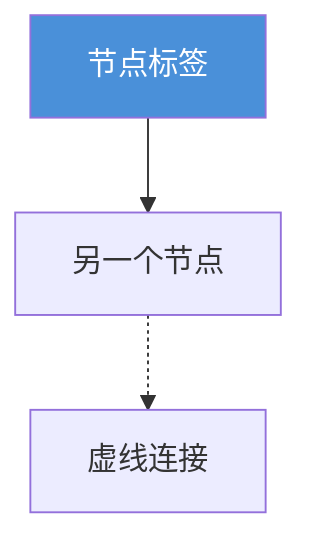
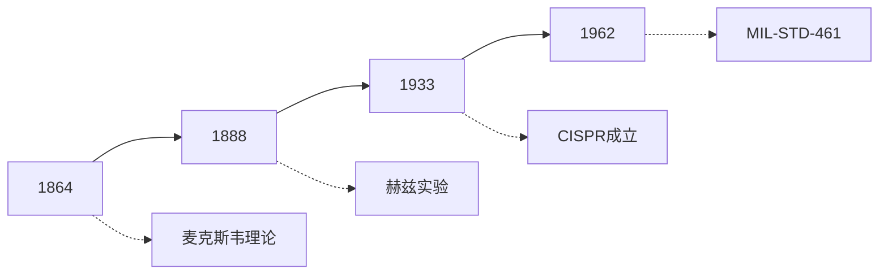
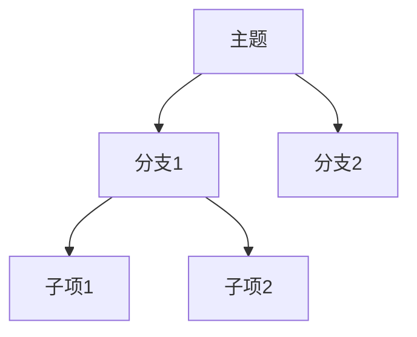

# Mermaid 兼容性指南

## 核心原则

教材中的 Mermaid 图需在尽可能多的渲染器中正常显示。以下规则基于实战验证中遇到的渲染失败问题总结。

## ✅ 可用语法

### graph (TD / LR) — 最稳定

### 节点标签规则
- ✅ 英文、中文、数字均可
- ✅ 方括号 `[]` 内用双引号包裹标签：`A["标签文字"]`
- ✅ 圆边节点：`A[("标签")]`
- ❌ **禁止 emoji**（`🔄` `⚠️` `🚫` `📋` `⭐⭐⭐⭐⭐` 等会导致渲染失败）
- ❌ **禁止特殊 Unicode**（星号 `⭐`、箭头等）

### 连接线规则
- ✅ `A --> B`（实线箭头）
- ✅ `A -.-> B`（虚线箭头）
- ✅ `A -->|"标签"| B`（带标签的实线）
- ❌ 避免 `<-->`（双向箭头，部分渲染器不支持）
- ❌ 避免跨 `subgraph` 边界的连接（从外部连接到 subgraph 内部的节点）

### subgraph 规则
- ✅ `subgraph "标题"` / `end`
- ❌ subgraph 标题中不要含括号 `()` 
- ❌ subgraph **内部不要用** `direction TB` 或 `direction LR`
- ❌ 不要从 subgraph 外部连接到内部的节点

## ❌ 不完全支持的语法

以下语法在部分渲染器中可能失败：

| 语法 | 风险 | 替代方案 |
|:-----|:-----|:---------|
| `timeline` | 仅在 Mermaid v10.2+ 支持 | 改用 `graph LR` 时间线 |
| `mindmap` | 部分渲染器不支持 | 改用 `graph TD` 树形结构 |
| `%%{init: ...}%%` | 部分渲染器不支持配置块 | 不使用，接受默认主题 |
| `<-->` 双向箭头 | 部分渲染器不支持 | 改用两条单向箭头 |
| subgraph 内 `direction` | 已知渲染 bug | 移除 direction，使用默认布局 |
| `style` 着色 | 大部分支持，个别渲染器颜色代码异常 | 保持简单颜色 |
| `graph` 节点标签内 emoji | ⚠️ 主要原因：`🔄` `⚠️` `🚫` `📋` `⭐` 等 emoji 导致解析失败 | 用纯文字替代 |

## 替代方案

### timeline 的替代

### mindmap 的替代

