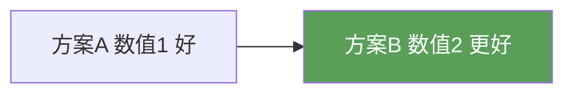

# Mermaid 图绘制规范（Obsidian兼容版）

## 致命规则（不遵守=图不渲染）

1. **`%%{init: ...}%%` 必须使用双引号JSON + 闭合 `}%%`**
   - ✅ 正确: `%%{init: {"flowchart": {"useMaxWidth": false}, "theme": "neutral"}}%%`
   - ❌ 错误: `%%{init: {'flowchart': {'useMaxWidth': false}}}%%`（单引号）
   - ❌ 错误: `%%{init: {"flowchart": {"useMaxWidth": false}}%%`（缺闭括号）

2. **Mindmap 只能有一个根节点**
   - Obsidian 的 Mermaid 实现限制 mindmap 只能有一个根，多根导致空白

3. **节点数 ≤ 30**
   - 超过30节点的Mermaid图在Obsidian中可能崩溃或白屏
   - 超过10个节点的图应拆分（如"本章总览"最多展示10个核心概念）

4. **标签含括号/逗号必须用引号包裹**
   - ✅ 正确: `A["label(text, with comma)"]`
   - ❌ 错误: `A[label(text, with comma)]`（引号内必须有中括号）

5. **`%%{init}` 必须独占一行**
   - 不能和其他Mermaid语句共享一行

## emoji 禁令（最关键！）

**永远不要在 Mermaid 节点标签中使用 Unicode emoji 字符。** 包括但不限于：
- ❌ `✅` ✓ ✓ → 改为 "达标/通过/正确/良好"
- ❌ `❌` ✗ ✗ → 改为 "不达标/失败/错误/不良"  
- ❌ `⚠️` → 改为 "注意/警告"
- ❌ `🔽` ➡️ → 改为 "降低/下降/减少"
- ❌ `✔` `✘` `★` `☆` `↑` `↓` → 改为纯文字

原因：不同 Obsidian 版本/平台的 Mermaid 渲染器对 emoji 的支持不一致。某些版本崩溃不渲染，某些在节点中显示乱码。

**安全替代：用文字 + 颜色样式表达对比**


## 陷阱：`[("text")]` 圆边节点括号顺序

**`[("...")]` 中的 `)` 必须放在 `"` 之后，不能放在之前。**

Mermaid 的圆边节点使用 `[("label")]` 语法。其中 `()` 是圆边形状标记，`""` 是标签字符串。`)"` 顺序导致 `)` 被吞入标签字符串，圆括号无法闭合，Mermaid 解析失败。

- ✅ 正确: `A[("双低阻抗<br>R_S低 R_L低")]` — `"` 先关闭标签，`")` 关闭圆边形状
- ❌ 错误: `A[("双高阻抗<br>R_S高 R_L高)"]` — `)"` 中 `)` 进入标签字符串，圆括号缺闭合

**直观检查方法**：扫描 Mermaid 块中所有 `[("...")]` 模式，确认每个都是 `")`（引号先闭，括号后闭），不是 `)"`（括号在引号之前）。

```bash
# 检查错误模式
grep -n '\[(".*)"\]' chapter.md | grep -v '")"\]'
# 如果输出了内容，就是错误顺序的节点
```

## `<br>` 标签的兼容性

- 在 `["label<br>line2"]` 中的 `<br>` 大多数Obsidian版本正常工作
- 高版本Obsidian（v1.5+）也支持 `\n` 换行，但不推荐混用
- 避免在 `<br>` 前后加空格

## Subgraph 命名规范

- **subgraph 名中不要使用中文括号/英文括号/破折号/逗号** —— 这些特殊字符在 Obsidian 的 Mermaid 解析器中会导致 Lexical error（词法分析崩溃），整张图不渲染。
- ✅ 推荐: `subgraph 频率响应分析` 或 `subgraph 整改前与整改后`
- ❌ 触发崩溃: `subgraph 频率响应（最重要）`, `subgraph 整改前后对比 — 关键频点(dB)`
- 如果需要对比分组，拆分为多个独立的 `graph LR` 块，每个块使用标题文字说明

## subgraph 内 direction 指令（陷阱）

**不要**在 `subgraph` 块内使用 `direction TB` / `direction LR`。某些 Mermaid 渲染器（特别是 Obsidian 内置渲染器）在 subgraph 内遇到 `direction` 指令时可能引发布局错乱或渲染失败。

- ❌ 错误:
  ```
  subgraph "六种干扰途径"
      direction TB
      A --> B
  end
  ```
- ✅ 正确: 去掉 `direction`，让子图继承父图的布局方向；或在需要改变布局时改用多个独立的 `graph LR`/`graph TD` 块替代 subgraph 嵌套。

## Style 声明

所有自定义颜色节点必须在图末尾有完整的 `style` 声明，不可遗漏。

可用颜色方案（暗色主题友好）：
- `fill:#4a90d9,color:#fff` — 主标题蓝色
- `fill:#d94a4a,color:#fff` — 警告/重点红色
- `fill:#e8a838,color:#333` — 注意/中间状态黄色（黑色文字）
- `fill:#5a9e5a,color:#fff` — 成功/正确绿色
- `fill:#888888,color:#fff` — 灰色次要节点

## xychart-beta 图表规范（Obsidian兼容版）

`xychart-beta` 是 Mermaid 9.x+ 引入的折线/柱状图类型，支持多数据系列。

### 合法关键字（仅以下5个）

```
title     — 图表标题
x-axis    — X轴标签和刻度值
y-axis    — Y轴标签和范围（min --> max）
bar       — 柱状图数据系列
line      — 折线图数据系列
```

### 非法关键字（会直接导致渲染失败）

- ❌ `bar-group-group` — 不存在于任何Mermaid版本中
- ❌ `test-chart` / 任何未列在合法关键字中的词

### 多数据系列写法

```mermaid
xychart-beta
    title "整改前后辐射发射对比"
    x-axis ["点1","点2","点3","点4"]
    y-axis "dBμV/m" 20 --> 55
    line [44.8,45.2,46.0,48.5]    # 系列1
    line [36.2,36.8,37.5,36.0]    # 系列2
    line [43.5,43.5,43.5,46.0]    # 系列3（限值线）
```

### 限制

- xychart-beta **无图例/legend**支持：多系列图表必须在注释中用文字说明各组含义
- 所有数据数组必须长度一致（与x-axis刻度数匹配）
- bar和line可在同一图表中混用：但不同版本Mermaid的混用表现不一致，推荐统一用line或统一用bar
- 频率/扫频数据建议用 `line`（连续曲线），分类数据建议用 `bar`（离散柱状）
