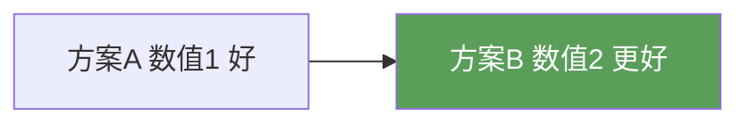

# Mermaid 图绘制规范（Obsidian兼容版）

## 致命规则（不遵守=图不渲染）

1. **`%%{init: ...}%%` 必须使用双引号JSON + 闭合 `}%%`**
   - ✅ 正确: `%%{init: {"flowchart": {"useMaxWidth": false}, "theme": "neutral"}}%%`
   - ❌ 错误: `%%{init: {'flowchart': {'useMaxWidth': false}}}%%`（单引号）
   - ❌ 错误: `%%{init: {"flowchart": {"useMaxWidth": false}}%%`（缺闭括号）

2. **Mindmap 只能有一个根节点**
   - Obsidian 的 Mermaid 实现限制 mindmap 只能有一个根，多根导致空白

3. **节点数 ≤ 30**
   - 超过30节点的Mermaid图在Obsidian中可能崩溃或白屏
   - 超过10个节点的图应拆分（如"本章总览"最多展示10个核心概念）

4. **标签含括号/逗号必须用引号包裹**
   - ✅ 正确: `A["label(text, with comma)"]`
   - ❌ 错误: `A[label(text, with comma)]`（引号内必须有中括号）

5. **`%%{init}` 必须独占一行**
   - 不能和其他Mermaid语句共享一行

## emoji 禁令（最关键！）

**永远不要在 Mermaid 节点标签中使用 Unicode emoji 字符。** 包括但不限于：
- ❌ `✅` ✓ ✓ → 改为 "达标/通过/正确/良好"
- ❌ `❌` ✗ ✗ → 改为 "不达标/失败/错误/不良"  
- ❌ `⚠️` → 改为 "注意/警告"
- ❌ `🔽` ➡️ → 改为 "降低/下降/减少"
- ❌ `✔` `✘` `★` `☆` `↑` `↓` → 改为纯文字

原因：不同 Obsidian 版本/平台的 Mermaid 渲染器对 emoji 的支持不一致。某些版本崩溃不渲染，某些在节点中显示乱码。

**安全替代：用文字 + 颜色样式表达对比**

## ` ` 标签的兼容性

- 在 `["label line2"]` 中的 ` ` 大多数Obsidian版本正常工作
- 高版本Obsidian（v1.5+）也支持 `\n` 换行，但不推荐混用
- 避免在 ` ` 前后加空格

## Subgraph 命名规范

- **subgraph 名中不要使用括号** `()` `（）` —— 虽然某些版本支持，但不一致性好
- ✅ 推荐: `subgraph 频率响应`
- ❌ 避免: `subgraph 频率响应（最重要）`

## Style 声明

所有自定义颜色节点必须在图末尾有完整的 `style` 声明，不可遗漏。

可用颜色方案（暗色主题友好）：
- `fill:#4a90d9,color:#fff` — 主标题蓝色
- `fill:#d94a4a,color:#fff` — 警告/重点红色
- `fill:#e8a838,color:#333` — 注意/中间状态黄色（黑色文字）
- `fill:#5a9e5a,color:#fff` — 成功/正确绿色
- `fill:#888888,color:#fff` — 灰色次要节点

## 图号标注

每张Mermaid图后面紧跟一行 `*图N-M：描述*`，中间不要有空行。
