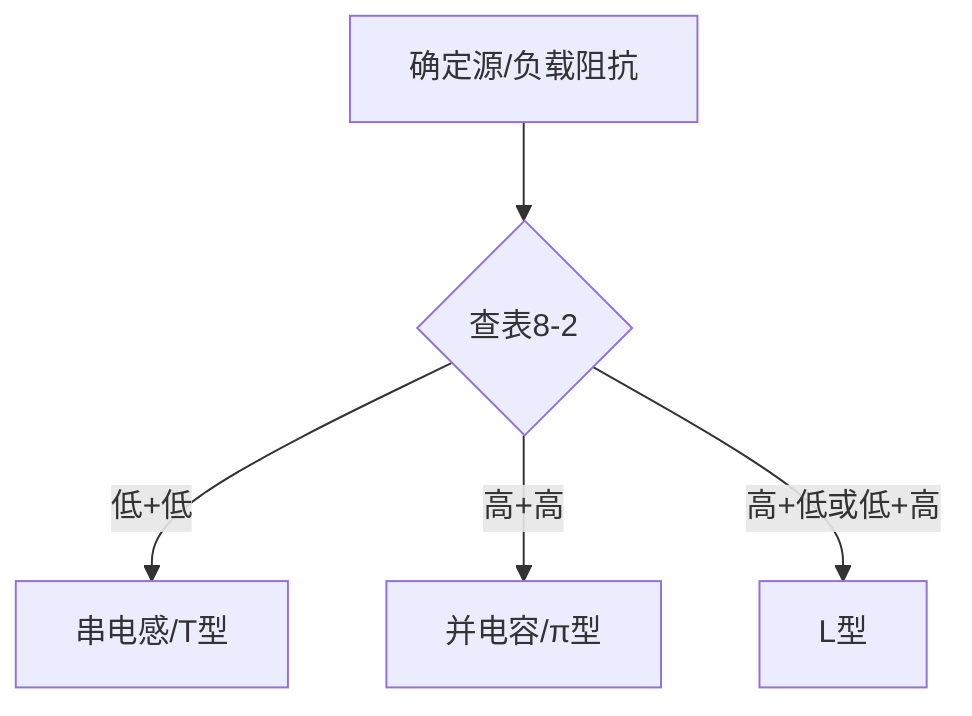

# YAML 内容质量检查清单（v52.4a）

管道 `preflight` 保障**格式正确性**（字段名、confidence、文件存在）。
本清单保障**内容深度质量**——preflight 不覆盖这些。

## KP/知识点 必查项

### 1. bloom_level 必须在 fm 中

```yaml
# ❌ 错误：只在 bd 中有描述，没在 fm 中声明
fm: {confidence: 0.85}
bd: {bloom_level_description: "应用层", ...}

# ✅ 正确：fm 中必须显式设置 bloom_level
fm: {confidence: 0.85, bloom_level: "3-应用"}
bd: {bloom_level_description: "应用层", ...}
```

`knowledge_template.md` 的 frontmatter 中有 `bloom_level: {{bloom_level}}`，YAML 的 `fm` 不提供 → 输出变成 `bloom_level: 无`。

对照关系：
| bd.bloom_level_description | fm.bloom_level |
|:---------------------------|:---------------|
| 知道层 | `1-知道` |
| 理解层 | `2-理解` |
| 应用层 | `3-应用` |
| 分析层 | `4-分析` |
| 评价层 | `5-评价` |
| 创造层 | `6-创造` |

### 2. theoretical_basis 深度 ≥150 中文字符

KP 模板标注 `<!-- theoretical_basis: ≥200字 -->`，实测 ≥150 字起效果可接受。

**深度模式 vs 浅模式**：
```
❌ 浅（69字）：铁氧体材料在>1MHz时呈现高阻抗抑制共模干扰。
✅ 深（200+字）：铁氧体材料在低频时磁导率很高...当频率升高到1MHz以上时，铁氧体材料的复磁导率中虚部（损耗项）显著增大...属于吸收式滤波——与反射式滤波器不同，它不产生反射驻波问题。
```

### 3. Wikilink 引用 ≥3 条

每 KP 的 `theoretical_basis` 和 `related_concepts` 中必须引用 3+ 个 `[[核心概念]]` 或 `[[知识要素]]`。完全无 wikilink 的 KP 降低知识库互联价值。

```yaml
bd:
  theoretical_basis: |
    反射式滤波器[[反射式滤波器]]由LC网络构成，根据[[滤波器]]基本工作原理...
  related_concepts: "[[反射式滤波器]]: 理论基础; [[电源线滤波器]]: 工程应用"
```

### 4. 公式必须用 `$$...$$` 包裹

```yaml
# ❌ 错误：纯文本公式
mathematical_model: "IL=10lg[1+(πfCR)²]"

# ✅ 正确：$$ 包裹
mathematical_model: >
  $$\\mathrm{IL}=10\\lg\\left[1+(\\pi fCR)^2\\right]\\tag{8-1}$$
```

概念中使用纯文本公式 → Obsidian 中不渲染 → 用户看到源码级文本。

### 5. derivation_diagram 与 Mermaid

当 KP 包含可推导的数学内容时（如反射式滤波器的 IL 公式选择），应提供 Mermaid 流程图：



`derivation_diagram: "无"` 对于纯描述性内容可以接受，但对于"结构选择""设计方法"类 KP 应提供 Mermaid。

## 概念文件必查项

### 公式字段必须 `$$` 包裹

`mathematical_model` 字段是唯一承载公式的位置。检查每个概念的 mathematical_model 是否：
- 源文有公式 → 用 `$$...$$` 格式写入（即使只一句）
- 源文无公式 → 写 `无`

### figure_references / formula_references

v7.0 模板已移除这两个字段。不要在 YAML bd 中包含它们 → preflight 会报告"多余"。

## 质量检查速查命令

```bash
# 检查 KP depth
for f in 50_知识点/第8章*.md; do
  content=$(cat "$f")
  tb=$(echo "$content" | grep -A1 "### 1. 理论基础" | tail -1)
  wl=$(echo "$content" | grep -oP '\[\[\K[^\]]+' | wc -l)
  echo "$f: tb_len=${#tb} wl=$wl"
done

# 检查公式是否用$$包裹（应返回有内容的行）
grep -P '^[^$].+=\s*10\s*lg' 30_核心概念/*.md

# 检查 bloom_level 是否为"无"
grep -l 'bloom_level: 无' 50_知识点/*.md
```

## 已知追踪

| 日期 | 问题 | 修复状态 |
|:-----|:-----|:---------|
| 2026-06-08 | 第8章4个KP bloom_level="无" | 未修复 |
| 2026-06-08 | 第8章4个KP理论基础<150字 | 未修复 |
| 2026-06-08 | 第8章4个KP无wikilink | 未修复 |
| 2026-06-08 | 第8章反射式滤波器公式纯文本 | 未修复 |
