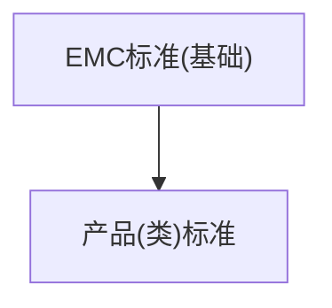
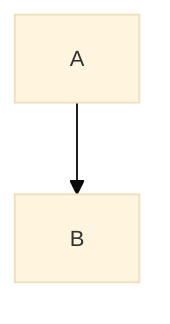

# Mermaid 核心概念图调试指南

## 常见渲染失败原因（按频率排序）

### 1. 标签中的括号/逗号未用引号包裹

**错误：**
```mermaid
graph TD
  A[EMC标准(基础)] --> B[产品(类)标准]
```

**正确：**


Mermaid 把 `(` 和 `)` 当作语法符号解析，标签内出现时会导致渲染报错 `Syntax error in graph`。

**所有需要引号的字符：** `( ) , [ ] { }`

### 2. 图的内容写在一行

**错误（单行图）：**
```yaml
core_concept_map: "graph TD A[EMC] --> B[EMD] A --> C[EMI]"
```

**正确（多行）：**
```yaml
core_concept_map: |-
  graph TD
    A[EMC] --> B[EMD]
    A --> C[EMI]
```

单行图虽然有些 mermaid 引擎能解析，但 Obsidian 中经常失败。

### 3. YAML 中 `\n` 不是换行符

**错误（双引号内的 `\n` 被当作文本）：**
```yaml
core_concept_map: "graph TD\nA[label] --> B[label2]"
```
`yaml.safe_load` 把 `\n` 当作真正的换行符吗？

**答案：在 YAML 双引号字符串中，`\n` 是换行符！** 所以「错误」示例其实是对的。

但 `yaml.dump` 在 `default_flow_style=False` 时输出的是**块标量**（`|-`），不会用双引号。

**安全做法：统一用 `|-` block scalar：**
```yaml
core_concept_map: |-
  graph TD
    A[label] --> B[label2]
```

**`|-` vs `|` 的区别：** `|-` 去除末尾换行，`|` 保留末尾换行。mermaid 代码块最好用 `|-`。

### 4. 内容不是 graph 格式而是文字描述

**错误（散文描述）：**
```
EMC是学科核心概念，涵盖EMI和EMD…
```
→ 引擎不转换，当作普通文字输出，不报错但无图。

**正确：必须是 `graph TD/LR` 开头：**
```
graph TD
  A[EMC] --> B[EMI]
  A --> C[EMD]
```

引擎的 `_auto_wrap_mermaid()` 只保护以 `graph `、`flowchart `、`sequenceDiagram` 开头的内容。散文描述不会被转换。

### 5. `%%{init: ...}%%` 配置格式

`%%{init: ...}%%` 必须用双引号的 JSON：


**常见错误：** 用单引号 `'theme': 'base'` → Obsidian 报错。必须双引号。
**注意：** `%%{` 的 `%%` 必须闭合——不能漏掉。

### 6. 节点 ID 过长或包含特殊字符

**Node ID 规范：**
- 可以用中文：`FDTD[时域有限差分法]` ✅
- 但不能有空格、括号、箭头符号
- 建议用英文缩写或拼音首字母：
  - `EMC_Sim[电磁兼容仿真分析]` ✅
  - `滤波器[滤波器]` ⚠️ 中文ID可能在某些渲染器出问题

## 批量验证工具

```bash
python3 scripts/validate_mermaid.py --book-dir /path/to/书目录
```

扫描 `30_核心概念/` 下所有文件，检测：
- 是否含 ```` ```mermaid ```` 代码块
- 标签中的括号/逗号是否引用
- 首行是否正确`graph / flowchart / sequenceDiagram`
- 是否为单行图

## 排查流程

1. **先跑 validate_mermaid.py** → 找到所有语法问题
2. **修 YAML** → 修改 `.dag/第N章/data/concepts.yaml` 的 `core_concept_map` 字段
3. **重渲染** → `pipeline_v2.py phase-a -c N --book-dir ...`
4. **验证** → 再次跑 validate_mermaid.py

## 关于 `_auto_wrap_mermaid()` 引擎层防护

`template_engine.py` 在渲染 `core_concept_map` 等字段时自动执行：

1. 检测值是否以 `graph ` / `flowchart ` / `sequenceDiagram` 开头
2. 如果是 → 用 ```` ```mermaid ```` 和 ```` ``` ```` 包裹
3. 如果已有 ```` ```mermaid ```` 或 `%%{init:` → 跳过（不重复包裹）
4. 其他内容（散文、空）→ 原样输出

**这意味着：** Agent 写 YAML 时不需要加 fence，引擎自动加。但如果 Agent 写了散文，引擎不会自动改成 graph ——需要 Agent 把内容写成 graph 格式。
